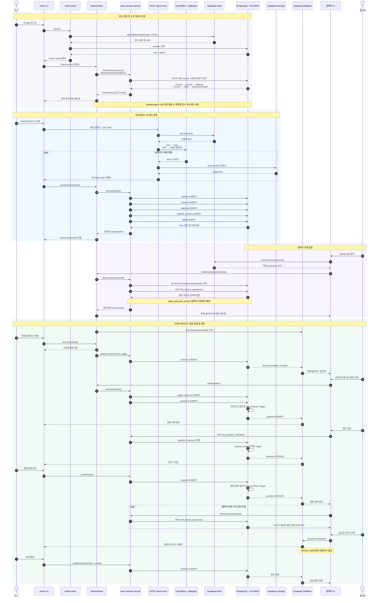

# Pin Class 데이터 플로우 설명서

- Status: 현재 구현 참조 문서
- Last verified: 2026-08-31
- Scope: `/admin`, `/join/[code]`, `/api/convert`, Supabase Auth·Database·Storage·Realtime
- Source of truth: 실행 코드와 로컬 Supabase 데이터베이스
- Related documents: `doc/pin_class_prd.md`, `docs/class-frontend-architecture.md`, `doc/pin_class_database_schema.md`

이 문서는 Pin Class에서 강사와 참여자의 입력이 어떤 계층을 지나 Supabase에 저장되고, 다시 화면으로 전달되는지 설명한다. 승인된 제품 계약을 새로 정의하지 않으며, 현재 코드의 동작을 이해하고 변경 영향을 추적하기 위한 참조 문서다.

## 1. 시스템 경계

Pin Class의 기본 의존 방향은 다음과 같다.

```text
View → Controller / SessionStore → Service → Supabase client
                                      ├─ Auth
                                      ├─ PostgreSQL + RLS/RPC
                                      ├─ Storage
                                      └─ Realtime
```

| 경계 | 책임 |
| --- | --- |
| View | 화면 렌더링, 사용자 입력, 접근 가능한 UI 제공 |
| Controller | 화면 상태, 사용자 이벤트, 오류 표현, 낙관적 갱신 조정 |
| `SessionStore` | 현재 구현의 application facade, 세션·폴더 상태와 공통 mutation 제공 |
| Service | Supabase 조회·저장, DB row와 UI model 변환 |
| Supabase infrastructure | owner/audience client 분리, 인증 세션과 토큰 관리 |
| PostgreSQL | 권위 데이터, FK·CHECK·Trigger·RLS 적용 |
| Storage | 변환된 슬라이드 이미지와 보존 자료 저장 |
| Realtime | 강의·질문·슬라이드 변경과 일회성 이모지 전달 |

## 2. 전체 데이터 플로우



## 3. 주요 흐름 설명

### 3.1 강사 인증과 관리자 가드

1. 강사는 Google OAuth PKCE 흐름으로 로그인한다.
2. `AuthProvider`는 Supabase 세션을 읽고 `profiles`에서 역할을 조회한다.
3. Supabase가 설정된 환경에서 `role = admin`이 아니면 `/admin` 가드는 로그인 화면으로 이동시킨다.
4. 강사 쓰기용 client는 최신 access token을 메모리에 보관해 슬라이드 이동 같은 짧은 mutation에서 반복적인 auth lock을 피한다.

### 3.2 관리자 데이터 로딩

- Supabase 모드에서는 PostgreSQL이 권위 원본이다.
- `fetchOwnedSessions()`는 소유자의 Course 그래프를 조회해 `ClassSession`으로 변환한다.
- 강사용 조회에는 `slide_instructor_notes`가 포함된다.
- 계정별 localStorage는 원격 조회 실패 시에만 사용하는 failure cache다. 로그아웃하거나 익명 사용자로 전환하면 이전 강사의 메모리 상태를 비운다.

### 3.3 자료 변환과 저장

1. 브라우저는 access token과 함께 파일을 `/api/convert`로 전송한다.
2. Route Handler는 `auth.getUser()`로 토큰을 검증한다.
3. PPT/PPTX는 LibreOffice로 PDF가 되고, PDF 페이지는 `pdftoppm`으로 JPEG가 된다.
4. 페이지가 완성되는 순서대로 `lecture-slides/{ownerId}/{uploadId}/{slideId}.jpg`에 저장된다.
5. 서버는 NDJSON 스트림으로 각 슬라이드 메타데이터를 브라우저에 전달한다.
6. 변환 완료 후 `persistSession()`이 Course, Lecture, Material, MaterialVersion, Slide row를 순서대로 생성한다.

현재 경로는 변환된 이미지를 `lecture-slides`에 저장한다. `material_versions.source_path`는 기록하지만 원본 PDF/PPT를 `course-materials`에 업로드하는 흐름은 연결되어 있지 않다.

### 3.4 참여자 입장과 질문 제출

- 참여자 페이지는 강사 세션과 별도의 Supabase auth storage key를 사용한다.
- 기존 세션이 없으면 anonymous user를 만든다.
- `fetchLiveSession()`은 `status = live`인 Lecture와 Material, 최신 MaterialVersion, Slides를 조회한다.
- 참여자 DTO에는 강사용 발표 메모를 포함하지 않는다.
- 참여자가 PIN을 남기면 0~1 정규화 좌표를 가진 `region_anchors`가 먼저 생성되고, 이를 참조하는 `questions`가 저장된다.
- 참여자는 본인이 작성한 미답변 질문만 수정할 수 있다. 이 제한은 UI뿐 아니라 RLS와 UPDATE 조건에도 적용된다.

### 3.5 질문 공감과 답변

- 공감은 `set_question_reaction(questionId, desiredState)` RPC를 사용한다.
- `question_reactions`의 복합 PK가 사용자별 중복 공감을 막는다.
- INSERT/DELETE Trigger가 `questions.reaction_count`를 동기화한다.
- 강사가 답변을 저장하면 `answers_capture_memory` Trigger가 질문 상태를 변경하고 질문·답변 문맥을 `course_brain_memory`에 기록한다.

### 3.6 Realtime과 보정 조회

- 활성 강의 하나에 대해 `lectures`, `questions`, `slides` 변경을 구독한다.
- 강의 페이지를 벗어나거나 활성 세션이 바뀌면 기존 채널을 제거한다.
- 참여자는 RLS 때문에 다른 작성자의 모든 row event를 직접 받지 못할 수 있다. 따라서 2초마다 `find_lecture_questions` RPC snapshot을 조회해 질문 순서, 공감 수, 답변과 종료 상태를 보정한다.
- 실시간 이모지는 Realtime Broadcast로만 전달하며 DB에는 저장하지 않는다.

### 3.7 Demo 모드

Supabase 환경 변수가 없는 demo 모드에서는 다음 경로가 권위 원본이다.

```text
SessionStore → localStorage → BroadcastChannel → 다른 브라우저 탭
```

Demo 모드는 로컬 시연을 위한 대체 경로이며, Supabase 모드의 RLS나 영속성 모델을 대신하지 않는다.

## 4. 보안 및 일관성 경계

| 경계 | 보장 |
| --- | --- |
| Admin Guard | Supabase 설정 시 admin이 아닌 사용자는 `/admin` 접근 불가 |
| Owner/Audience client 분리 | 같은 브라우저에서 강사·참여자 화면을 열어도 participant 쓰기가 admin JWT로 전송되지 않음 |
| RLS | 소유 강의 관리, 참여자의 live 강의 읽기, 본인 질문 수정 범위 제한 |
| 발표 메모 | owner 전용 테이블과 조회 경로에만 존재하며 참여자 DTO에서 제외 |
| 좌표 | 참여자 신규 anchor는 `point`, 좌표는 0~1 범위 |
| Storage 경로 | 첫 경로 segment가 인증 사용자 ID인지 Storage policy가 검증 |
| 낙관적 갱신 | 쓰기 실패 시 직전 화면 상태로 rollback하거나 오류 표시 |
| Realtime cleanup | 세션 이동 시 기존 channel 제거 |

## 5. 구현 위치

| 역할 | 경로 |
| --- | --- |
| Provider 조합 | `app/layout.tsx` |
| 강사 인증 | `app/_controller/auth-context.tsx` |
| Admin Guard | `app/(view)/admin/layout.tsx` |
| 공통 session facade | `app/_controller/session-store.tsx` |
| Supabase domain service | `app/_service/class-session-service.ts` |
| Browser Supabase client | `app/_infrastructure/supabase/client.ts` |
| Server token client | `app/_infrastructure/supabase/server.ts` |
| 파일 변환 API | `app/api/convert/route.ts` |
| 강사 라이브 controller | `app/(view)/admin/session/[id]/controller.ts` |
| 발표 controller | `app/(view)/admin/session/[id]/present/controller.ts` |
| 참여자 controller | `app/(view)/join/[code]/controller.ts` |
| DB migration | `supabase/migrations/*` |

## 6. 문서 갱신 조건

다음 변경이 발생하면 이 문서를 함께 갱신한다.

- View → Controller → Service 의존 방향 변경
- owner/audience 인증 저장소 또는 역할 판정 변경
- 업로드·Storage 경로 또는 원본 자료 보존 방식 변경
- 질문, 답변, 공감, 발표 메모의 RLS 변경
- Realtime publication, 구독 table 또는 보정 polling 변경
- `SessionStore`가 route-local controller로 대체되는 구조 변경
