# Pin Class 데이터베이스 스키마 설명서

- Status: 현재 구현 참조 문서
- Last verified: 2026-08-31
- Database: Supabase CLI 로컬 PostgreSQL
- Scope: `public` schema, `auth.users` 참조, Storage bucket, Realtime publication
- Related documents: `doc/pin_class_prd.md`, `doc/pin_class_data_flow.md`

이 문서는 로컬 Supabase 데이터베이스를 직접 조회해 확인한 현재 스키마를 설명한다. 승인된 제품 계약을 새로 정의하지 않으며, migration과 실제 DB 구조를 이해하기 위한 참조 문서다.

## 1. 검증 기준

| 항목 | 확인 결과 |
| --- | --- |
| Supabase CLI | `2.116.0` |
| 마지막 적용 migration | `20260830074411_restrict_participant_anchors_to_point` |
| `public` table | 18개 |
| RLS | 18개 table 모두 활성화 |
| Migration drift | `supabase db diff --local --schema public` 결과 없음 |
| Realtime publication | `lectures`, `questions`, `slides`, `campaigns`, `feedback_pins` |

`auth_users`는 ERD 표현을 위한 이름이며 실제로는 Supabase 관리 schema의 `auth.users`다. `campaigns`, `campaign_pages`, `feedback_pins` 계열은 제거된 `/pin` 런타임의 보존 데이터다. 현재 Pin Class 흐름과 타입을 섞지 않는다.

## 2. 전체 ERD

```mermaid
erDiagram
    %% auth_users represents Supabase auth.users.
    auth_users ||--o| profiles : "has profile"
    auth_users ||--o{ session_folders : "owns"
    auth_users ||--o{ courses : "owns"
    auth_users ||--o{ campaigns : "owns"
    auth_users o|--o{ questions : "authors"
    auth_users ||--o{ answers : "authors"
    auth_users ||--o{ question_reactions : "reacts"
    auth_users o|--o{ feedback_pins : "authors"
    auth_users ||--o{ feedback_pin_reactions : "reacts"
    auth_users o|--o{ platform_experience_responses : "submits"

    session_folders o|--o{ courses : "groups"
    session_folders o|--o{ campaigns : "groups"

    courses ||--o{ lectures : "contains"
    courses ||--o{ materials : "contains"
    courses ||--o{ questions : "receives"
    courses ||--o{ course_brain_memory : "stores"

    lectures ||--o{ materials : "uses"
    lectures ||--o{ questions : "receives"
    lectures o|--o{ course_brain_memory : "produces"
    lectures o|--o{ platform_experience_responses : "evaluated by"

    materials ||--o{ material_versions : "versions"
    material_versions ||--o{ slides : "contains"
    material_versions ||--o{ region_anchors : "anchors"

    slides ||--o| slide_instructor_notes : "has private note"
    slides ||--o{ region_anchors : "contains"
    slides o|--o{ questions : "anchors"

    region_anchors o|--o{ questions : "locates"
    questions ||--o{ answers : "answered by"
    questions ||--o{ question_reactions : "reacted to"

    campaigns ||--o{ campaign_pages : "contains"
    campaigns ||--o{ feedback_pins : "receives"
    campaigns o|--o{ platform_experience_responses : "evaluated by"
    feedback_pins ||--o{ feedback_pin_reactions : "reacted to"

    auth_users {
        uuid id PK
    }

    profiles {
        uuid id PK, FK
        user_role role
        text email
        text display_name
        text avatar_url
        timestamptz created_at
        timestamptz updated_at
    }

    session_folders {
        uuid id PK
        uuid owner_id FK
        text name
        timestamptz created_at
        smallint color_index
    }

    courses {
        uuid id PK
        uuid owner_id FK
        text title
        text subject_domain
        text visibility
        timestamptz created_at
        uuid folder_id FK
    }

    lectures {
        uuid id PK
        uuid course_id FK
        integer seq_no
        text title
        text join_code UK
        text interaction_mode
        lecture_status status
        integer current_page
        timestamptz started_at
        timestamptz ended_at
        timestamptz created_at
        boolean show_question_pins
        text presentation_qr_position
        boolean show_presentation_qr
        boolean presentation_interactions
        jsonb question_categories
    }

    materials {
        uuid id PK
        uuid course_id FK
        uuid lecture_id FK
        text type
        text file_name
        timestamptz created_at
    }

    material_versions {
        uuid id PK
        uuid material_id FK
        integer version_no
        text source_path
        text checksum
        timestamptz created_at
    }

    slides {
        uuid id PK
        uuid material_version_id FK
        integer page_index
        text image_path
        integer width_px
        integer height_px
        timestamptz created_at
    }

    slide_instructor_notes {
        uuid slide_id PK, FK
        text body
        timestamptz created_at
        timestamptz updated_at
    }

    region_anchors {
        uuid id PK
        uuid slide_id FK
        uuid material_version_id FK
        text kind
        jsonb coords
        text created_by
        timestamptz created_at
    }

    questions {
        uuid id PK
        uuid course_id FK
        uuid lecture_id FK
        uuid slide_id FK
        uuid region_id FK
        uuid author_id FK
        boolean is_anonymous
        text category
        text raw_text
        question_status status
        text occurred_in
        timestamptz created_at
        timestamptz updated_at
        integer reaction_count
        text marker
    }

    answers {
        uuid id PK
        uuid question_id FK
        uuid author_id FK
        text body
        text visibility
        boolean is_ai_generated
        uuid_array source_chunk_ids
        timestamptz created_at
    }

    question_reactions {
        uuid question_id PK, FK
        uuid reactor_id PK, FK
        timestamptz created_at
    }

    course_brain_memory {
        uuid id PK
        uuid course_id FK
        uuid lecture_id FK
        text chunk_type
        uuid source_id
        text content
        vector embedding
        boolean reuse_consent
        timestamptz created_at
    }

    campaigns {
        uuid id PK
        uuid owner_id FK
        text title
        text guide_text
        text join_code UK
        text image_path
        integer image_width
        integer image_height
        campaign_status status
        timestamptz created_at
        timestamptz updated_at
        text_array audience_groups
        boolean show_presentation_qr
        text presentation_qr_position
        jsonb feedback_categories
        uuid folder_id FK
        boolean show_presentation_pin_status
        text presentation_pin_status_position
        boolean presentation_autoplay
    }

    campaign_pages {
        uuid id PK
        uuid campaign_id FK
        integer page_index
        text image_path
        integer image_width
        integer image_height
        timestamptz created_at
        text_array audience_groups
    }

    feedback_pins {
        uuid id PK
        uuid campaign_id FK
        uuid author_id FK
        boolean is_anonymous
        numeric x
        numeric y
        text category
        text body
        boolean hidden
        timestamptz created_at
        timestamptz updated_at
        integer page_index
        text marker
        integer reaction_count
    }

    feedback_pin_reactions {
        uuid pin_id PK, FK
        uuid reactor_id PK, FK
        timestamptz created_at
    }

    platform_experience_responses {
        uuid id PK
        uuid lecture_id FK
        uuid campaign_id FK
        uuid author_id FK
        text experience
        text improvement
        timestamptz created_at
    }
```



## 3. Pin Class 핵심 테이블

### 3.1 사용자와 폴더

| 테이블 | 역할 | 주요 제약 |
| --- | --- | --- |
| `auth.users` | Google 강사와 anonymous 참여자 인증 원본 | Supabase Auth 관리 |
| `profiles` | 사용자 역할과 표시 정보 | `id → auth.users.id`, 역할은 `admin` 또는 `participant` |
| `session_folders` | 강사가 소유한 강의 자료 폴더 | `owner_id → auth.users.id`, `(id, owner_id)` unique |

`courses.folder_id`는 단순 폴더 FK가 아니라 `(folder_id, owner_id) → session_folders(id, owner_id)` 복합 FK다. 다른 사용자의 폴더에 Course를 연결할 수 없다. 폴더가 삭제되면 Course 자체는 삭제되지 않고 `folder_id`만 `NULL`이 되어 미분류로 이동한다.

### 3.2 강의 자료 계층

```text
Course → Lecture → Material → MaterialVersion → Slide
```

| 테이블 | 역할 | 주요 제약 |
| --- | --- | --- |
| `courses` | 소유권과 폴더 경계가 되는 강의 묶음 | owner 기준 RLS |
| `lectures` | join code와 라이브 상태를 가진 강의 세션 | `join_code` unique, `(course_id, seq_no)` unique |
| `materials` | Lecture에서 사용하는 PDF 또는 slide deck | Course와 Lecture 모두 참조 |
| `material_versions` | 자료의 버전과 source path | `(material_id, version_no)` unique |
| `slides` | 변환된 페이지 이미지 | `(material_version_id, page_index)` unique |
| `slide_instructor_notes` | 슬라이드별 강사용 발표 메모 | `slide_id`가 PK이자 FK, 참여자 접근 불가 |

강의 삭제는 상위 Course 삭제를 시작점으로 하위 Lecture, Material, Version, Slide가 cascade된다. Storage object는 FK로 연결되지 않으므로 service가 별도로 정리한다.

### 3.3 질문과 위치

| 테이블 | 역할 | 주요 제약 |
| --- | --- | --- |
| `region_anchors` | Slide 위 질문 위치 | 참여자 신규 anchor는 `point`, 좌표는 0~1 범위 |
| `questions` | 질문 원문, 카테고리, marker, 상태와 공감 수 | Course·Lecture·Slide·Anchor·작성자 참조 |
| `answers` | 강사 답변 | Question 및 답변 작성자 참조 |
| `question_reactions` | 참여자별 질문 공감 desired state | `(question_id, reactor_id)` 복합 PK |

`questions.slide_id`, `region_id`, `author_id`는 보존 및 익명화 상황을 위해 nullable이다. 참여자 신규 질문 흐름에서는 live Lecture, 본인 anonymous user, point anchor를 요구한다.

### 3.4 Course Brain

`course_brain_memory`는 질문과 답변 원문을 Course/Lecture 문맥에 연결해 저장하는 원장이다. 현재 Trigger가 원문을 적재하지만 embedding 생성과 RAG 검색은 아직 연결되어 있지 않다.

| 컬럼 | 의미 |
| --- | --- |
| `chunk_type` | `question`, `answer` 등 memory 종류 |
| `source_id` | 원본 Question 또는 Answer ID |
| `content` | 원문 |
| `embedding` | 향후 벡터 검색용 값 |
| `reuse_consent` | 재사용 동의 여부 |

## 4. 보존 중인 Pin Feedback 스키마

다음 테이블은 현재 `/pin` 런타임에서는 사용하지 않지만 migration history와 기존 데이터를 보존하기 위해 남아 있다.

| 테이블 | 역할 |
| --- | --- |
| `campaigns` | 과거 feedback campaign 설정과 join code |
| `campaign_pages` | campaign의 다중 이미지 페이지 |
| `feedback_pins` | 이미지 좌표 기반 feedback |
| `feedback_pin_reactions` | feedback pin 공감 |
| `platform_experience_responses` | Lecture 또는 Campaign 종료 경험 설문 |

`campaigns.folder_id`도 Course와 같은 owner 복합 FK를 사용한다. Pin Class와 Pin Feedback 사이에는 승인된 일회성 import 외에 런타임 타입이나 UI 의존성을 추가하지 않는다.

## 5. Enum

| Enum | 값 |
| --- | --- |
| `user_role` | `admin`, `participant` |
| `lecture_status` | `live`, `ended`, `archived` |
| `question_status` | `unanswered`, `answered`, `resolved`, `archived` |
| `campaign_status` | `live`, `ended`, `archived` |
| `question_category` | `concept`, `why`, `example`, `error`, `important` |

현재 `questions.category`는 동적 강의별 카테고리를 지원하기 위해 `text`이며, `lectures.question_categories` JSON 설정과 Trigger가 유효성을 검증한다. `question_category` enum은 migration history에 남아 있지만 현재 컬럼 타입으로 사용되지 않는다.

## 6. RLS 접근 모델

모든 `public` 테이블에 RLS가 활성화되어 있다.

| 주체 | 허용 범위 |
| --- | --- |
| 강사 admin | 본인이 소유한 Folder, Course, Lecture, Material, Slide, Question, Answer, 발표 메모 관리 |
| 익명 participant | live Lecture와 연결된 Course, Material, Version, Slide 조회 |
| 질문 작성자 | 본인의 질문과 연결 anchor·answer 조회, 미답변 질문 수정 |
| 다른 participant | 공개 RPC가 반환하는 live 강의 질문 조회와 타인 질문 공감 |
| 보존 campaign 참여자 | 참여한 live campaign과 본인 feedback 범위 |

주요 보안 경계는 다음과 같다.

- `private.is_admin()`과 `private.is_participant()`가 Google 강사와 anonymous 참여자를 구분한다.
- Course와 Campaign 소유권은 `private.course_owned()`와 `private.campaign_owned()`로 검사한다.
- 참여자는 live Lecture에서만 질문을 생성할 수 있다.
- 참여자는 본인 질문에 공감할 수 없고, reaction 복합 PK가 중복을 막는다.
- `slide_instructor_notes`는 admin이면서 해당 Course 소유자인 경우에만 접근할 수 있다.
- 참여자용 service 조회는 발표 메모 컬럼을 요청하지 않는다.

## 7. Trigger와 RPC

### 7.1 Trigger

| Trigger | 동작 |
| --- | --- |
| `questions_validate_category` | INSERT/UPDATE 질문 카테고리가 Lecture 설정에서 활성 상태인지 검증 |
| `questions_capture_memory` | 새 질문을 `course_brain_memory`에 기록 |
| `answers_capture_memory` | 답변 후 질문 상태를 변경하고 답변을 Course Brain에 기록 |
| `question_reactions_sync_count` | reaction INSERT/DELETE 후 `questions.reaction_count` 동기화 |
| `lectures_validate_question_categories` | Lecture 카테고리 JSON 구조와 활성 개수 검증 |
| `feedback_pin_reactions_sync_count` | 보존 feedback pin 공감 수 동기화 |

### 7.2 Pin Class public RPC

| 함수 | 목적 |
| --- | --- |
| `find_lecture_questions(target_lecture_id)` | 참여자에게 RLS 범위의 질문, 답변, 공감 상태 snapshot 제공 |
| `set_question_reaction(target_question_id, target_reacted)` | 공감 desired state 저장 |
| `append_lecture_slides(target_material_version_id, new_slides)` | 슬라이드 추가와 page index 처리 |
| `delete_lecture_slide(target_slide_id)` | 마지막 슬라이드 보호와 관련 row 정리 |
| `import_feedback_campaign(...)` | 과거 Campaign을 Pin Class 자료로 일회성 복사 |
| `submit_platform_experience_response(...)` | 종료 경험 설문 저장 |

## 8. Realtime

`supabase_realtime` publication에는 다음 `public` 테이블이 포함된다.

| 테이블 | 소비자 |
| --- | --- |
| `lectures` | 강사·참여자의 현재 슬라이드, 상태, PIN/QR 설정 동기화 |
| `questions` | 질문 추가·수정·상태·공감 수 갱신 |
| `slides` | 라이브 슬라이드 추가·삭제 반영 |
| `campaigns` | 보존 campaign 플레이어 설정 |
| `feedback_pins` | 보존 campaign feedback 갱신 |

`answers`는 publication에 직접 포함되지 않는다. 답변 INSERT Trigger가 `questions`를 갱신하므로 질문 UPDATE event와 참여자의 2초 RPC snapshot 조회를 통해 답변 상태가 반영된다.

## 9. Storage

| Bucket | 공개 여부 | 제한 | 현재 용도 |
| --- | --- | --- | --- |
| `lecture-slides` | Public | 10 MiB, JPEG/PNG/WebP | 변환·추가된 강의 슬라이드 이미지 |
| `course-materials` | Private | 40 MiB, PDF/PPT/PPTX | 원본 자료용으로 정의됐으나 현재 업로드 흐름 미연결 |
| `campaign-images` | Public | 10 MiB, JPEG/PNG/WebP | 보존 campaign 이미지 |

DB의 `image_path`와 `source_path`는 Storage object를 문자열로 참조한다. PostgreSQL FK가 아니므로 row 삭제와 object 삭제를 하나의 DB cascade로 처리할 수 없다. 삭제 service는 먼저 관련 경로를 조회하고 DB 삭제 후 Storage object를 정리한다.

## 10. 삭제 및 보존 규칙

| 부모 삭제 | 결과 |
| --- | --- |
| `auth.users` | 소유 Profile, Folder, Course, Campaign cascade |
| `session_folders` | Course/Campaign은 보존되고 `folder_id`만 `NULL` |
| `courses` | Lecture, Material, Question, Course Brain cascade |
| `lectures` | Material, Question 및 관련 응답 cascade |
| `materials` | MaterialVersion과 Slide cascade |
| `slides` | Anchor와 발표 메모 cascade, Question의 `slide_id`는 `NULL` |
| `questions` | Answer와 QuestionReaction cascade |
| `campaigns` | CampaignPage, FeedbackPin과 관련 응답 cascade |

Storage object와 DB row의 생명주기는 FK로 묶여 있지 않으므로, 삭제 오류를 성공으로 표시하지 않고 service에서 부분 실패를 처리해야 한다.

## 11. 문서 갱신 절차

스키마가 바뀌면 다음 순서로 이 문서를 갱신한다.

1. forward-only migration을 추가한다.
2. `npm run supabase:reset`으로 clean database에 migration을 재생한다.
3. `information_schema`, `pg_constraint`, `pg_policies`, `pg_publication_tables`를 다시 조회한다.
4. ERD의 컬럼, FK, cardinality와 테이블 설명을 수정한다.
5. RLS, Trigger, RPC, Realtime, Storage 변경을 해당 절에 반영한다.
6. `supabase db diff --local --schema public` 결과가 비어 있는지 확인한다.
