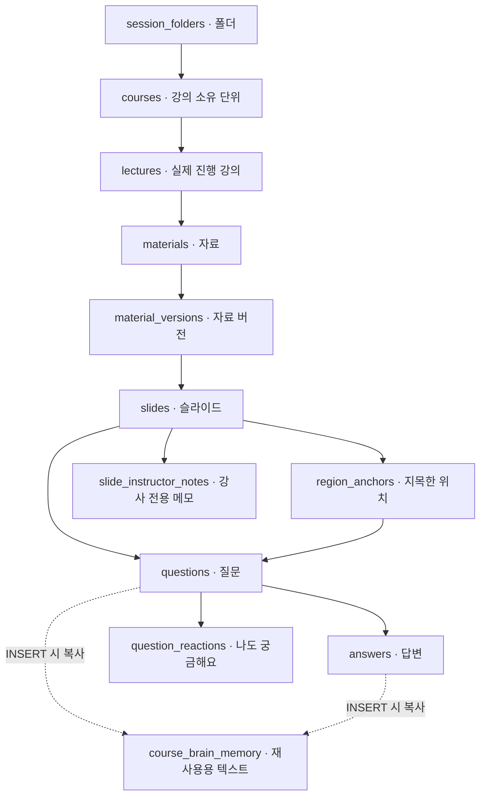

**ClassPin 운영 DB·SQL 상세 분석과 특허 후보의 기술적 근거**

작성일: 2026-08-31. 분석 대상: pin_class / Supabase project ref ggysjcfczzyknblwwesr.
조회 방식: Supabase 플러그인의 읽기 전용 메타데이터 조회와 SELECT. 운영 DB 및 제품 코드는 변경하지 않았다. 질문·답변 원문, 사용자 식별자, 이메일, 인증 정보는 조회 결과로 가져오지 않았다. 집계와 SQL 정의를 분석했다.

운영 데이터 첫 집계 기준 시각은 22:26:36 KST이며, 후속 품질 집계는 22:29 이후다. 전체 검토를 하나의 장기 트랜잭션으로 수행한 것은 아니므로 시점이 다른 결과를 영구 불변 수치로 취급하면 안 된다. 정확한 집계값과 조회문은 동봉 기록에 있다.

**판독 방법**

- 확인: 운영 메타데이터, SELECT 결과 또는 현재 저장소 코드에서 확인했다.
- 설계: 프로젝트의 AI 리포트 문서에 정의되어 있으나 운영 구현은 확인되지 않는다.
- 제안: 이번 특허 논의에서 새로 구체화한 연구·개발 방향이다.
- 정적 위험: SQL에 방어 조건이 없거나 약하다는 뜻이다. 실제 악용·유출이 일어났다는 뜻은 아니다.

한국 출원을 우선 가정한 기술 검토이며, 등록 가능성·권리 침해 여부에 대한 법률 의견은 아니다. 선행문헌의 제목만으로 신규성·진보성이나 침해를 판단하지 않았으며, 후보를 정한 후 청구항별 대조와 추가 조사가 필요하다.

**1. 실제 운영 구조**

프로젝트는 ACTIVE_HEALTHY, 지역 ap-south-1, PostgreSQL 17.6 계열이다. public 테이블 18개 모두 RLS가 켜져 있다. public 제약 110개, 인덱스 48개, public/private 함수 39개, public 일반 트리거 6개, public RLS 정책 38개를 수집했다. Edge Function 목록은 비어 있다. 이것만으로 외부 서버의 AI 실행 여부까지 부정할 수는 없지만, 이번에 본 코드·DB에는 AI 리포트 실행 경로와 리포트 테이블이 없다.

자료는 아래처럼 연결된다. 폴더는 정리 단위이며 학습 개념이나 개정판 계보와 동일하지 않다.

DB에는 course_id 등 직접 연결도 중복 저장된다. 위 그림은 이해를 위한 주 연결이며 전체 FK 목록은 SQL 근거 기록에 있다.

| 영역 | 실제 행 수 | 해석 |
| --- | ---: | --- |
| 폴더 | 3 | 화면 정리 단위 |
| course / lecture / material / version | 50 / 45 / 45 / 45 | course 중 lecture가 없는 행 5개 |
| slide / anchor / question | 425 / 936 / 936 | 모든 질문에 현재 slide와 anchor가 있음 |
| answer / question reaction | 8 / 28 | 답변이 있는 질문도 8개 |
| course_brain_memory | 944 | 질문 936 + 답변 8의 텍스트 복사 |
| 완료 설문 | 0 | 학습 효과 측정 자료로 사용할 수 없음 |
| 과거 campaign / feedback pin | 24 / 1,001 | 은퇴한 PinFeedback 데이터로 별도 취급 |

과거 도구의 추정 행 수가 아니라 SELECT count(*) 값이다. 프로필 개수로 실사용 학생 수를 추산하지 않았다.

**2. AI 분석 전에 반드시 알아야 하는 데이터의 성격**

질문 936개 중 906개는 source_path가 pin-feedback/로 시작하는 자료에 연결되어 있다. 그중 occurred_in=post는 902개, live는 4개다. 나머지 자료에 연결된 30개는 live다. 906개 모두가 과거 질문을 그대로 복제한 것이라고 단정할 수는 없다. 가져온 자료에도 이후 새 질문을 남길 수 있기 때문이다. 다만 전체를 순수 ClassPin 수업 실험 데이터로 취급하는 것은 타당하지 않다.

private.import_feedback_campaign은 소유한 예전 캠페인을 강의 구조로 옮기는 함수다. 숨겨진 피드백을 제외하고, 페이지를 새 슬라이드와 매핑하고, 위치·본문·카테고리·반응을 옮긴다. source_path의 부분 UNIQUE 인덱스와 트랜잭션 advisory lock으로 중복 이관을 막는다. 복사된 질문은 post로 저장한다. 재현 가능한 분석에는 자료 출처뿐 아니라 질문별 출처도 구분해야 한다.

모든 material version은 version_no=1이다. 버전을 2개 이상 가진 material은 0개다. checksum이 채워진 version도 0개다. 슬라이드 크기 width_px/height_px는 425개 중 36개만 채워져 있다.

이는 개정판 비교가 불가능한 상품이라는 뜻이 아니다. 현재 수집 구조만으로 과거와 현재의 같은 설명 부분을 자동 비교할 증거가 아직 부족하다는 뜻이다. 이미지 크기는 저장된 실제 이미지에서 읽을 수 있고, 해시는 파일 바이트에서 계산할 수 있다. 다만 어떤 시점의 파일을 기준으로 고정했는지까지 정해야 한다.

질문 상태는 unanswered 923, answered 3, resolved 10이다. resolved 중 5개에는 답변 행이 없다. 해결 표시와 답변 작성은 다른 동작이다. 어느 쪽도 학생이 이해했다는 시험 결과나 재확인 결과를 의미하지 않는다.

**3. 저장·조회·공감·답변·삭제 SQL을 따라간 결과**

| 흐름 | 실제 처리 | 장점 및 주의점 |
| --- | --- | --- |
| 자료 업로드 | persistSession이 course → lecture → material → version 1 → slides를 차례로 저장 | 여러 API 요청이므로 전체가 한 트랜잭션은 아니다. 실패 중간 상태 가능성이 있다. lecture 없는 course 5개는 확인했지만 원인을 실패로 단정하지 않는다. |
| 질문 작성 | submitQuestion이 point를 검사하고 anchor INSERT 후 question INSERT | 각 INSERT는 독립 요청이다. 두 번째 실패 시 고아 anchor가 남을 수 있으나 현재 집계는 0개다. |
| 질문 메모리 | questions_capture_memory가 INSERT 뒤 본문을 brain에 복사 | 원본 INSERT와 복사는 같은 DB 트랜잭션이다. UPDATE/DELETE 동기화는 없다. |
| 질문 수정 | raw_text/category/marker/updated_at을 갱신 | brain의 이전 본문은 갱신되지 않는다. 원본과 복사본이 다른 사례가 현재 1개 있다. |
| 답변 작성 | answers INSERT → capture_answer_memory → 질문 상태 answered → brain 복사 | 상태를 answered로 덮어쓰므로 resolved 질문에 추가 답변 시 상태가 되돌아갈 수 있다. 학습 성취 판정은 아니다. |
| 해결 표시 | questions.status를 resolved로 갱신 | 별도 답변이나 학생 확인을 요구하지 않는다. |
| 공감 | set_question_reaction(question_id, desired_boolean) RPC | 참가자·live·비보관 질문·본인 질문 금지 검사, 강의/질문 잠금, 복합 PK, ON CONFLICT로 중복 및 동시성 처리 |
| 공감 집계 | 반응 INSERT/DELETE 트리거가 reaction_count 증감 | 원본 반응 개수와 집계 열의 불일치는 현재 0개다. 반복 클릭을 숫자 증가 명령으로 처리하지 않는다. |
| 참여자 질문 목록 | find_lecture_questions RPC | 사용자 UUID 대신 is_mine/reacted_by_me를 반환하고 답변은 participants/public만 포함한다. 개인 메모를 반환하지 않는다. |
| 슬라이드 추가 | append_lecture_slides가 소유권 확인, version 행 잠금 후 1~20장 추가 | page_index 충돌을 제어하지만 같은 material version의 내용이 바뀐다. |
| 슬라이드 삭제 | delete_lecture_slide가 version 잠금, 마지막 한 장 삭제 금지, 질문 삭제, 페이지 재정렬, 현재 페이지 조정 | DB 처리는 원자적이다. Storage 파일 삭제는 별도다. 연결된 brain source_id에 FK가 없어 향후 고아 텍스트가 남을 수 있다. 현재 고아 메모리 집계는 0개다. |

핵심 코드: [저장·조회 서비스](/Users/minchanpark/Documents/pin_class/app/_service/class-session-service.ts:157), [질문 제출](/Users/minchanpark/Documents/pin_class/app/_service/class-session-service.ts:606), [답변·해결](/Users/minchanpark/Documents/pin_class/app/_service/class-session-service.ts:656).

course_brain_memory의 embedding은 944개 모두 NULL이고 reuse_consent=true도 0개다. 이름이 Brain이라는 이유로 이미 의미 검색이나 학습 재사용이 완성됐다고 볼 수 없다. embedding은 텍스트 의미를 숫자 배열로 표현하는 값이다. 동의 플래그의 부재는 동의를 확보했다는 증거가 없다는 뜻이며, 리포트 생성·다른 강의 재사용·모델 학습 각각의 허용 목적을 별도로 판단해야 한다.

이번 AI 리포트의 원본은 questions/answers/region_anchors/slides와 실제 반응이어야 한다. brain 복사본을 원본 대신 읽으면 수정 전 질문을 분석할 수 있다.

**4. 무결성: 현재 데이터가 맞는 것과 앞으로도 틀린 데이터를 못 넣는 것은 다르다**

현재 확인한 불일치는 아래와 같다.

| 검사 | 결과 |
| --- | ---: |
| 질문 course와 lecture의 course 불일치 | 0 |
| 질문 lecture/course와 slide 소속 불일치 | 0 |
| 질문의 slide와 anchor의 slide 불일치 | 0 |
| anchor의 version과 slide의 version 불일치 | 0 |
| 반응 개수와 reaction_count 불일치 | 0 |
| 질문 없는 anchor | 0 |
| source 질문/답변 없는 brain | 0 / 0 |
| 원본 질문과 brain 본문 불일치 | 1 |
| 원본 답변과 brain 본문 불일치 | 0 |

하지만 각각의 FK는 대상 행의 존재만 확인한다. 질문, 위치, 슬라이드, 자료 버전, 강의가 모두 같은 계보에 속한다는 복합 조건은 완전히 강제되지 않는다. 질문 INSERT RLS는 live lecture와 course 일치를 확인하지만 slide와 region까지 같은 계보인지 검사하지 않는다. anchor INSERT도 전달된 material_version_id와 slide의 실제 version 일치를 확인하지 않는다.

AI 전처리는 소유권과 전체 연결을 다시 검사하고 잘못된 근거 묶음은 거부해야 한다. 장기적으로 저장 경계에서 원자 제출과 계보 제약을 보강하는 것이 맞지만 이번 작업에서는 수정하지 않았다.

좌표 검증에도 NULL 처리 구멍이 있다. point CHECK에서 x/y가 누락되면 결과가 false가 아니라 NULL이 된다. PostgreSQL CHECK는 NULL을 통과시킨다. private.valid_normalized_path도 필수 필드와 points 배열이 없는 객체에서 true를 반환했다. 이는 SELECT로 함수와 조건식만 평가했으며 잘못된 행을 INSERT하지 않았다. 현재 저장된 point의 필수 숫자 누락과 path의 필수 형태 누락 집계는 각각 0개다. 전체 기하학적 품질을 모두 보증하는 검사는 아니다. [PostgreSQL CHECK 공식 설명](https://www.postgresql.org/docs/17/ddl-constraints.html)

**5. 권한·공개 파일·배포 이력**

RLS는 행마다 확인하는 출입문에 해당한다. 테이블에 켜져 있다는 사실만으로 모든 문이 올바르게 잠겼다는 뜻은 아니다.

- 소유자 경계: course 소유자를 중심으로 접근을 제한하고, 폴더는 folder_id+owner_id 복합 FK가 있어 다른 사람 폴더에 연결하는 것을 막는다.
- 강사 메모: slide_instructor_notes에 분리되어 있고 관리자·소유자 정책이 있다. 참여자 service 조회에서 speakerNote를 제외한다. AI 근거에도 포함하면 안 된다.
- 참여자 경계: 익명 세션도 Supabase에서는 authenticated 역할을 사용할 수 있다. private.is_participant로 프로필 역할을 추가 검사한다. 익명 로그인 자체는 제품의 의도된 동작이다.
- 강의 범위: participant SELECT 정책과 find_lecture_questions는 live 여부를 검사하지만 강의별 참여 이력이나 join code 소지 증명을 DB에서 확인하지 않는다. 화면에서 join code로 찾는 것과 DB가 그 강의만 허용하는 것은 다른 문제다. 공개 참여 범위를 어디까지 허용할지 제품 계약과 대조해야 한다.
- 비공개 답변: 목록 RPC는 visibility를 필터링하지만 answers의 'question authors view answers' 직접 SELECT 정책에는 visibility 조건이 없다. 현재 private 답변은 0개이고 기본 작성은 participants다. 향후 private 답변을 도입하면 질문 작성자가 직접 읽는 경로를 함께 막아야 한다. 실제 유출을 관찰한 것은 아니다.
- 공감 테이블: question_reactions는 일반 역할의 직접 권한을 없애고 RPC로만 처리한다. RLS 정책 0개라는 Advisor 알림만 보고 공개 SELECT 정책을 추가하면 안 된다.
- 권한 최소화: 일부 핵심 테이블의 authenticated에 TRUNCATE 등 일반 Data API 사용에 불필요한 넓은 테이블 권한도 있다. REST로 즉시 해당 명령을 실행할 수 있다는 의미는 아니지만 향후 SQL 실행 경로가 생기기 전에 최소 권한을 검토할 항목이다.

Storage는 course-materials가 private, lecture-slides와 campaign-images가 public이다. 공개 버킷의 파일은 URL을 가진 사람이 다운로드할 수 있다. DB에서 강의 조회를 제한해도 이미 알려진 이미지 URL의 접근을 같은 방식으로 차단하지는 않는다. AI 보고서와 분석용 이미지 사본은 승인 설계대로 별도 private 저장소가 필요하다. [Supabase 공개 버킷 설명](https://supabase.com/docs/guides/storage/buckets/fundamentals)

운영 migration 이력은 36개, 마지막은 20260819162110_delete_class_materials다. 저장소에는 그 뒤 4개가 더 있다. 그러나 '4개 모두 미적용'이라고 결론 내리면 틀린다.

| 저장소 변경 | 운영에서 확인한 실제 상태 |
| --- | --- |
| 20260825062205 validator EXECUTE 복구 | 현재 일반 authenticated EXECUTE 없음. 후속 변경이 다시 회수하도록 하므로 이것만으로 오류라고 판단하지 않음 |
| 20260825085611 lecture category CHECK 제거·권한 회수 | CHECK 없음, 권한 회수됨. 최종 효과와 일치 |
| 20260829141150 folder color_index | 컬럼·기본값·범위 CHECK 존재 |
| 20260830074411 participant point 제한 | 운영 anchor INSERT 정책에는 kind='point'가 없음. 현재 코드/문서와 차이 |

정확한 적용 경로는 확인하지 못했다. migration 기록과 실제 정의가 어긋난다. 따라서 이전 로컬 분석에서 'DB도 참여자 point만 허용한다'고 설명한 부분은 운영 기준으로 정정한다. 현재 UI/service는 point만 제출하지만 운영 DB 정책은 box/path를 신규 차단하지 않는다. 기존 데이터는 point 931, path 5다.

**6. 성능·운영 관찰**

Supabase Advisor 결과는 보안 21건, 성능 27건이다. 이는 취약점 21개 또는 병목 27개를 확정한 숫자가 아니다.

- 보안: 익명 접근 관련 WARN 17건은 익명 참여 제품의 정책을 이해하고 판독해야 한다. [검토 안내](https://supabase.com/docs/guides/database/database-advisors?queryGroups=lint&lint=0012_auth_allow_anonymous_sign_ins)
- RLS 정책 없음 INFO 2건은 공감 테이블들이다. RPC 전용 설계와 함께 판독해야 한다. [검토 안내](https://supabase.com/docs/guides/database/database-linter?lint=0008_rls_enabled_no_policy)
- public.submit_platform_experience_response의 SECURITY DEFINER 실행 WARN 1건: 함수는 인증, 코드, 상태, 본문 길이를 확인한다. 권한 상승 함수라는 이유만으로 취약점이라고 단정하지 않는다. [검토 안내](https://supabase.com/docs/guides/database/database-linter?lint=0029_authenticated_security_definer_function_executable)
- 유출 비밀번호 보호 비활성 WARN 1건: 현재 Google OAuth와 익명 로그인 중심 흐름을 고려하되 비밀번호 로그인을 사용하게 되면 검토해야 한다. [안내](https://supabase.com/docs/guides/auth/password-security#password-strength-and-leaked-password-protection)
- FK 인덱스 없음 INFO 10건: questions.slide_id/region_id, region_anchors.slide_id/material_version_id 등이 포함된다. AI의 슬라이드별 묶음 조회와 삭제 경로에서 먼저 측정할 후보이다. [안내](https://supabase.com/docs/guides/database/database-linter?lint=0001_unindexed_foreign_keys)
- 미사용 인덱스 INFO 5건은 수집 기간과 실제 워크로드를 보지 않고 삭제하면 안 된다. [안내](https://supabase.com/docs/guides/database/database-linter?lint=0005_unused_index)
- 복수 허용 RLS 정책 WARN 12건은 역할별 의도를 보존하며 비용을 측정해야 한다. [안내](https://supabase.com/docs/guides/database/database-linter?lint=0006_multiple_permissive_policies)

question lecture/time, answer question, version material/version_no, slide version/page_index에는 유용한 인덱스가 있다. vector 확장은 설치됐지만 brain 검색용 ANN 인덱스는 없다. 현재 embedding도 없고 첫 AI 리포트는 RAG를 제외하므로 별도 벡터 DB를 먼저 만들 이유는 없다. 대용량 실행계획이나 사용자 응답시간 벤치마크를 수행하지 않았으므로 속도 개선 수치를 제시하지 않는다.

Realtime publication은 lectures/slides/questions와 과거 campaigns/feedback_pins다. 화면의 일시적 emoji broadcast는 영속 학습 로그가 아니다. 공감 테이블의 '나도 궁금해요' 28건과 화면을 지나가는 emoji를 섞어 집계하면 안 된다. 현재 페이지 값 하나로 학생이 어떤 슬라이드를 얼마나 봤는지도 복원할 수 없다.

**7. 특허 후보 6개: 보호하려는 처리 방식**

다음은 출원 청구항 완성본이 아니라 발명 명세를 구체화하기 위한 구성이다. 최상위 '강의 AI' 같은 결과 이름보다 입력·처리·출력·오류 차단·검증 가능한 효과를 기술한다.

**기존 ① 위치와 자료 버전에 붙어 있는 질문**

쉬운 뜻: 학생의 포스트잇을 '책 3쪽의 분수 그림'에 정확히 붙여 둔다.

입력은 slide/version 식별자와 정규화 좌표, 질문이다. 좌표를 화면 픽셀이 아니라 0~1 비율로 저장하여 다른 화면에서도 동일 위치로 표시한다. 질문·위치·슬라이드·버전을 연결하고 답변/상태/반응을 붙인다. 이는 기존 구현의 기반이다. 개정판 간 위치 이동까지 구현된 것은 아니다.

가치: 질문의 지시 대상과 당시 자료를 보존한다. 그러나 실시간 문서 주석과 버전별 주석은 알려져 있다. 단독 출원 우선순위는 낮으며 이후 공간 근거 분석의 구성으로 쓰는 편이 합리적이다. [실시간 문서 주석 문헌](https://patents.google.com/patent/US20170185575A1/en), [문서 계열·버전 주석 문헌](https://patents.google.com/patent/US8539346B2/en)

검증: 화면 크기별 같은 지점, 잘못된 좌표 거부, 다른 버전/슬라이드 연결 거부. 현재 운영 DB의 계보·좌표 검증 공백을 해결하지 않고 '항상 정확한 원본 참조'를 주장하면 안 된다.

**기존 ② 원래 위치는 보존하고 겹치는 핀만 펼쳐 보이는 기술**

쉬운 뜻: 같은 곳에 포스트잇 20장이 겹쳤을 때 읽기 좋게 펼치고 각각 실로 원래 자리에 연결한다.

원본 좌표와 표시 좌표를 분리한다. 현재 코드는 가까운 후보 위치부터 찾아 핀을 배치하고 선으로 원래 지점을 연결한다. 핀 크기 30px, 후보 간격 38px는 현재 구현값이며 발명의 본질을 그 숫자만으로 설명하면 안 된다. 현재 선택한 말풍선은 유지하고 다른 핀/말풍선과 겹치는 비활성 말풍선은 숨긴다. 자동 재생은 현재 표시 집합에서 떨어진 질문을 우선 골라 공간적으로 펼친다. 수용량을 넘으면 일부 겹침을 허용하므로 '무조건 겹침 0'은 아니다.

[실제 배치·재생·말풍선 코드](/Users/minchanpark/Documents/pin_class/app/_model/class/presentation-rotation.ts:14)

특허 검토점은 원본 증거 좌표 불변 + 화면 경계/충돌 제약 + 활성 말풍선 보존 + 공간적 재생의 결합과 상호작용이다. 단순 라벨 충돌 회피와 연결선은 알려져 있다. 기존 기능 중 추가 검토할 후보지만 신규성을 확인한 것은 아니다. [라벨 배치 선행문헌](https://patents.google.com/patent/US8749588B2/en)

검증: 동일한 실제 핀 묶음으로 겹침 면적, 클릭 누락, 원래 지점 오인, 재배치 시 흔들림을 비교한다. 편해 보인다는 인상만으로 기술적 효과가 입증되지는 않는다.

**AI ① 공간 후보와 의미 검증으로 잘못된 결론을 차단하는 리포트**

쉬운 뜻: AI가 '애들이 분수를 몰라요'라고 말하기 전에, 포스트잇이 같은 분수 부분을 가리키는지와 질문 내용도 같은 문제인지 모두 확인한다.

승인 근거 명세에 있는 핵심 규칙:
1. 기준 시점의 자료·질문·답변·반응을 snapshot으로 고정한다.
2. 민감정보를 가린 전체 슬라이드, 위치 오버레이, 질문별 crop을 만든다. point crop은 가로·세로 각각 40%, box/path는 경계 상자에 각 축 10% 여백과 최소 40% 크기를 적용한다. 가장자리에서는 crop만 이동하며 원본 좌표는 바꾸지 않는다. 좌표가 없으면 위치를 상상하지 않는다.
3. 같은 슬라이드를 20×20 격자로 나눠 점유 셀 또는 인접 8칸에 있는 질문만 공간 비교 후보로 만든다. 좌표 없는 질문끼리는 별도 비공간 후보로 둔다.
4. AI는 후보 쌍을 같은 결론 지지/모순/무관으로 판정한다.
5. 결론에 묶인 모든 질문 쌍이 허용된 후보이며 지지 판정을 받았는지 코드가 확인한다. A-B와 B-C가 닮았다고 A-C를 생략하지 않는다.
6. 2개 미만이면 반복 패턴 판단을 보류한다. 공감과 답변은 독립 질문 수를 늘리지 않는다. 모순은 다수결로 지우지 않고 양쪽과 제한적 근거 수준을 남긴다.
7. 수치는 코드가 계산하고 AI는 검증된 metric 참조만 쓴다. 각 결론을 원본 version/slide/question에 연결한다.
8. 코드 검증 뒤 다른 계열의 고정 AI가 비평한다. 통과한 슬라이드 결과만 합성하고 합성 과정에서 새 사실이나 관계를 만들지 못하게 한다.

기술 핵심은 공간 필터 → 의미 관계 → 모든 쌍 검증 → 결론 허용 범위 제어다. 격자 크기와 crop 비율만 바꿔 새 기술이라고 주장하지 않는다. 질문 군집과 교육 리포트 자체는 알려져 있다. [응답 군집 선행문헌](https://patents.google.com/patent/US20190340948A1/en), [학습 반응·리포트 선행문헌](https://patents.google.com/patent/US20240161647A1/en)

현재 운영 구현은 없다. 2개 레코드는 2명의 사람이나 통계적 유의성을 뜻하지 않는다. 공간이 가깝다고 같은 의미도 아니며, 멀리 있는 같은 개념은 이 공간 규칙에서 놓칠 수 있다. 질문이 한 위치에 몰리면 모든 쌍 비교량은 최악에 제곱으로 늘 수 있다. 입력 한도와 비용 통제가 필요하다.

검증은 '텍스트만 분석', '위치만 묶기', '모든 쌍 검증 생략', '제안 방식'을 같은 평가셋에서 비교한다. 잘못 합친 비율, 놓친 관계, 근거 없는 결론, 모순 은폐, 처리시간과 비용을 측정한다. 평가 사례에는 같은 말·다른 위치, 같은 위치·다른 뜻, 모순, 질문 0/1/2개, 과거 피드백 이관 데이터를 포함한다.

**AI ② 개정판의 같은 설명 부분을 찾아 비교 허용 여부를 결정하는 기술**

쉬운 뜻: 지난주 3쪽의 분수 그림이 이번 주 5쪽으로 옮겨져도 같은 부분을 찾아 비교한다. 그림이 삭제됐거나 두 조각으로 나뉘었으면 단순히 질문이 줄었다고 칭찬하지 않는다.

제안 처리:
- 같은 자료 계보의 이전/새 버전을 구분하고 이미지·텍스트·배치 특징으로 영역 대응 후보를 만든다.
- 유지, 이동, 내용 변경, 분할, 병합, 삭제, 대응 불명으로 분류한다.
- 대응 근거와 불확실성을 저장한다. 비교 기준을 넘지 못하면 전후 비교를 보류한다.
- 분할/병합에서 하나의 질문을 여러 번 세지 않도록 질문 귀속 또는 가중치 규칙을 고정한다.
- 비교 가능한 대응 영역만 집계한다. 노출 집계를 추가한다면 같은 방식으로 실제 본 참여 세션 수 등을 분모로 사용한다.
- 학습 개선의 인과 결론은 내리지 않는다. 학생 구성·설명 시간·질문 참여 습관이 달라질 수 있기 때문이다.

필요 데이터: 안정적인 material 계보, 실제 개정판, 원본 이미지 해시, 이전·다음 영역의 대응 관계/종류/신뢰 정보/알고리즘 버전. 노출 보정을 원하면 현재 없는 슬라이드별 노출 집계가 추가로 필요하다. 테이블 이름은 예시로 material_region_mappings, slide_exposure_aggregates를 생각할 수 있으나 현재 승인 스키마는 아니다.

예: 질문 10→5만 보면 감소지만 실제 노출이 100→20이라면 세션 100개당 질문은 10→25다. 숫자는 설명용 가정이며 운영 DB의 성과가 아니다. 0회 노출이나 신뢰할 수 없는 분모에서는 비율을 계산하지 않는다.

이미 주석을 새 문서로 옮기는 기술은 있다. 검토할 차이는 대응의 불확실성이 비교 허용 여부와 지표에 전파되는 처리다. [주석 이동 선행문헌](https://patents.google.com/patent/US20140115436A1/en)

검증: 페이지 이동, 동일 그림 재등장, 내용 변경, 영역 분할/병합, 삭제, 슬라이드 추가/삭제, 노출 변화 사례에서 잘못된 대응과 가짜 개선 판정을 측정한다. 현재 운영 자료에는 이 검증에 필요한 버전 쌍이 없다.

**AI ③ 사실·근거를 고정하고 표현만 고치는 리포트**

쉬운 뜻: '질문이 3개 있었다'는 조사 카드를 잠근 다음 '쉽게 써줘'를 허용한다. '많은 학생이 실패했다'로 바꾸는 것은 허용하지 않는다.

분석 claim은 특허 청구항이 아니라 리포트의 개별 결론을 뜻한다. canonical 결과에 결론의 의미, 종류, 근거 수준, 지지/반대 질문, slide/version과 metric 참조를 고정한다. revision은 문장 표현·순서·강조·길이·표시할 결론의 선택만 바꾼다. 축약해 숨긴 결론도 원본 기록에서는 지우지 않는다. 금지된 수정이 섞여 있으면 요청 전체를 거부하고 기존 결과를 유지한다.

새 질문으로 분석하는 report version과 같은 질문으로 문장만 고치는 revision은 다르다. A/B 화면과 PDF는 같은 확정 revision을 렌더링하고 AI를 재호출하지 않는다. hash는 데이터 변경 감지 수단이지 문장 의미가 같다는 증명 수단이 아니다. 의미 변형에는 별도 비평과 평가가 필요하다.

프로젝트 문서에 설계되어 있으나 운영 report/revision 테이블은 없다. 구현은 별도 graph DB 없이 PostgreSQL 관계형 행과 버전 명시 JSONB로 가능하다.

이 방향은 매우 가까운 선행연구가 있다. 2026-08-26 공개된 Claim-Locked Reporting은 출처·수치·방향·허용 표현 강도를 산문 생성 전에 고정한다. 출처 추적 문서 생성 특허도 있다. 따라서 범용 '사실을 고정하고 글만 고침'의 단독 우선순위는 낮게 본다. 공간 근거와 모순 관계를 revision 전후 불변으로 다루는 구체 구성의 차이를 추가 검토해야 한다. [Claim-Locked Reporting](https://arxiv.org/abs/2608.25336), [출처 추적 문서 생성](https://patents.google.com/patent/US12511301B1/en)

검증: 같은 snapshot에서 새 숫자 삽입, 모순 삭제, 의미 강화, 다른 자료 참조, 부분 수정 범위 이탈을 시도했을 때 거부되는지와 정상 축약을 지나치게 거부하지 않는지 확인한다.

**AI ④ 개인정보를 가렸더니 핵심 증거도 사라진 경우 판단을 멈추는 기술**

쉬운 뜻: 자료 속 전화번호를 검은 테이프로 가렸는데 학생이 바로 그 가려진 부분을 질문했다면, AI는 테이프 아래 내용을 추측하지 않고 '이 부분은 확인할 수 없어요'라고 말한다.

이미 승인된 기본 설계는 내부 OCR → 이메일/전화번호/token/key 패턴 탐지 → 분석용 사본 가림 → 그 사본으로 crop/overlay 생성이다. OCR과 가림이 실패하면 원본을 대신 보내지 않고 전체 작업을 실패시킨다. 원본 파일은 변경하지 않는다.

새 제안은 그 위에 '가림 때문에 주장에 필요한 증거가 사라졌는가'를 판정하는 것이다. mask 영역과 질문 anchor/crop의 교차, 해당 결론이 요구하는 문자·숫자·도형의 가시성, 남은 주변 맥락을 함께 검사한다. 작은 숫자 하나가 결정적일 수 있어 가림 면적 비율만으로 판정하면 안 된다. 필요 근거가 가려졌거나 확신이 없으면 영향받는 결론만 보류 상태로 만들고, 다른 결론은 기존 검증을 통과했을 때만 유지한다. 가림 때문에 판단을 보류한 유효 결과와 OCR 처리 자체 실패를 구분해야 한다.

필요 데이터는 mask의 위치·민감정보 종류·OCR/규칙 버전·원본/사본 해시·결론별 영향/보류 사유다. 가려진 원문 값이나 복원용 매핑은 외부 AI에 보내지 않는다. 모르는 내용을 복원하는 모델을 만드는 것이 목표가 아니다.

개인정보 가림 자체는 알려져 있다. 차이는 가림의 결과가 해당 공간 근거의 사용 가능성과 결론 허용 여부를 바꾼다는 점이다. 아직 핵심 필요성 판정법과 오탐 처리 기준을 더 구체화해야 하는 연구 후보이다. [선택적 비식별화 선행문헌](https://patents.google.com/patent/US20250307456A1/en)

검증: 질문과 무관한 전화번호 가림, 질문이 지목한 숫자 가림, 인접하지만 무관한 가림, 거의 전부 가림, OCR 누락/오탐을 나눠 무근거 단정과 불필요한 보류를 측정한다. 패턴 기반 OCR만으로 모든 개인정보가 제거된다고 보증할 수는 없다.

**8. 공통 AI 시스템: 신뢰할 수 있는 '증거 봉투' 만들기**

승인 문서에는 여섯 테이블이 제안되어 있다.

| 설계 테이블 | 쉬운 뜻 |
| --- | --- |
| ai_reports | 보고서 한 권과 기준 시점 |
| ai_report_materials | 그 보고서가 본 자료 목록 |
| ai_report_slides | 슬라이드별 질문·답변 증거 봉투와 검사 결과 |
| ai_report_revisions | 같은 조사 결과로 바꿔 쓴 문장 이력 |
| ai_report_jobs | 어느 작업을 어디까지 처리했는지 |
| ai_report_storage_cleanup | 삭제할 비공개 파일을 놓치지 않는 할 일 목록 |

현재 이 여섯 테이블은 운영 DB에 없다. [시스템 명세](/Users/minchanpark/Documents/pin_class/docs/ai-instructor-report-system.md:36)

진행 순서는 소유권 재확인 → 짧은 DB transaction에서 snapshot/job 저장 → 비공개 worker의 파일 확인·OCR·가림·crop → 생성 AI → 코드 검사 → 다른 계열의 고정 AI 비평 → 모든 슬라이드 성공 후 전체 합성·비평 → 강사 검토·확정 → PDF다.

- snapshot: 질문과 답변이 처리 중 바뀌어도 보고서의 근거가 섞이지 않도록 고정한다. 복사본은 영원히 보존한다는 뜻이 아니며 source 삭제 정책과 함께 삭제된다.
- 해시: 파일·자료 내용의 지문이다. 현재 원본 checksum이 비어 있으므로 최초 기준값 확보와 확인 시점, 변경 중 경쟁 조건을 구현 전에 명확히 해야 한다. version UUID만으로 내용 불변을 가정하면 안 된다.
- 비동기 처리: 현재 설계는 별도 Cloud Run worker와 Cloud Tasks를 사용한다. 브라우저를 닫아도 DB 작업 상태가 남고, 재시도·중복 전달을 같은 작업 식별자로 통제한다.
- 개인정보: 외부 AI에는 실제 DB UUID 대신 snapshot 안의 별칭을 보내고 author ID/이메일/세션/인증 정보/강사 메모를 제외한다. 이미지뿐 아니라 질문·답변 텍스트도 가린다.
- 공급자 경계: 승인 설계는 고정 생성·비평 모델, Zero Data Retention과 데이터 수집 거부, 자동 fallback 금지다. 실제 공급자 조건은 구현 시 다시 확인하고 검증해야 한다.
- 비용: 생성 전 범위·수량·예상비용, 한도, 재시도 상한을 정한다. 개인정보 보호나 검증 실패를 비용을 아끼기 위해 생략하지 않는다.
- 실패: 한 슬라이드가 최종 실패하면 조용히 제외한 부분 보고서를 성공으로 내놓지 않는다. 수정 실패는 이전 정상 revision을 보존한다.
- 삭제: DB report 삭제와 파일 정리 작업 기록을 같은 transaction으로 처리하고, 외부 Storage 삭제 실패는 별도 정리 작업으로 재시도한다.
- 검증: 근거 부족, 모순, 잘못된 참조/좌표, metric 불일치, 금지 revision, 개인정보, 누락 슬라이드, 중복 작업을 출시 차단 사례로 둔다. 다른 AI가 검토해도 무오류 보증이나 강사 확정의 대체는 아니다.

**9. 판단의 우선순위와 다음 연구의 목적**

| 후보 | 상태 | 현재 판단 |
| --- | --- | --- |
| 기존 ① 위치·버전 질문 | 구현 기반 있음 | 단독 출원 우선순위 낮음 |
| 기존 ② 원본 위치 보존·핀 펼침·재생 | 관련 코드 있음 | 기존 기능 중 구체 조합 검토 |
| AI ① 공간·의미·모든 쌍 검증 | 문서 설계 | 우선 발명 정리·실험 후보 |
| AI ② 개정판 대응·비교 허용 제어 | 새 확장 제안 | 제품 차별화 잠재력 있으나 신규 데이터·실험 필요 |
| AI ③ 사실 고정·표현 revision | 문서 설계 | 가까운 선행기술로 단독 우선순위 낮춤 |
| AI ④ 가림에 따른 근거 보류 | 새 연구 제안 | 판정 알고리즘을 구체화해야 함 |

이 표는 등록 확률 순위가 아니다. 개발과 명세 구체화에 먼저 시간을 쓸 순서다. '교육에 AI를 적용했다'는 결과만으로 충분하지 않으며 구체 처리 수단과 그 차이에서 발생하는 효과를 제시해야 한다. [한국 지식재산 당국의 AI 발명 요건 안내](https://www.kipo.go.kr/ko/kpoContentView.do?menuCd=SCD0201244)

**10. 내부 근거 문서**

- [PRD](/Users/minchanpark/Documents/pin_class/doc/pin_class_prd.md)
- [AI 근거 명세](/Users/minchanpark/Documents/pin_class/docs/ai-instructor-report-evidence.md)
- [AI 제품 명세](/Users/minchanpark/Documents/pin_class/docs/ai-instructor-report-product.md)
- [AI 시스템 명세](/Users/minchanpark/Documents/pin_class/docs/ai-instructor-report-system.md)
- [기존 DB 문서](/Users/minchanpark/Documents/pin_class/doc/pin_class_database_schema.md) — 운영 실측과 차이가 있으면 이번 실측을 구분해서 읽어야 한다.
- 동봉된 운영DB_SQL_근거기록.md와 운영DB_구조_집계.json — 원본 고객 내용이 없는 구조·집계·조회 기록. SQL 정의는 검토용이며 실행·복원 스크립트가 아니다.

