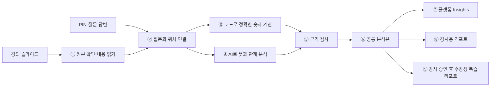
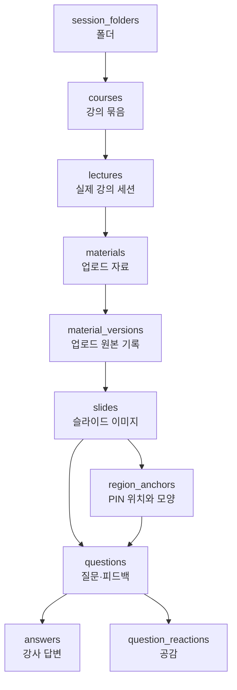
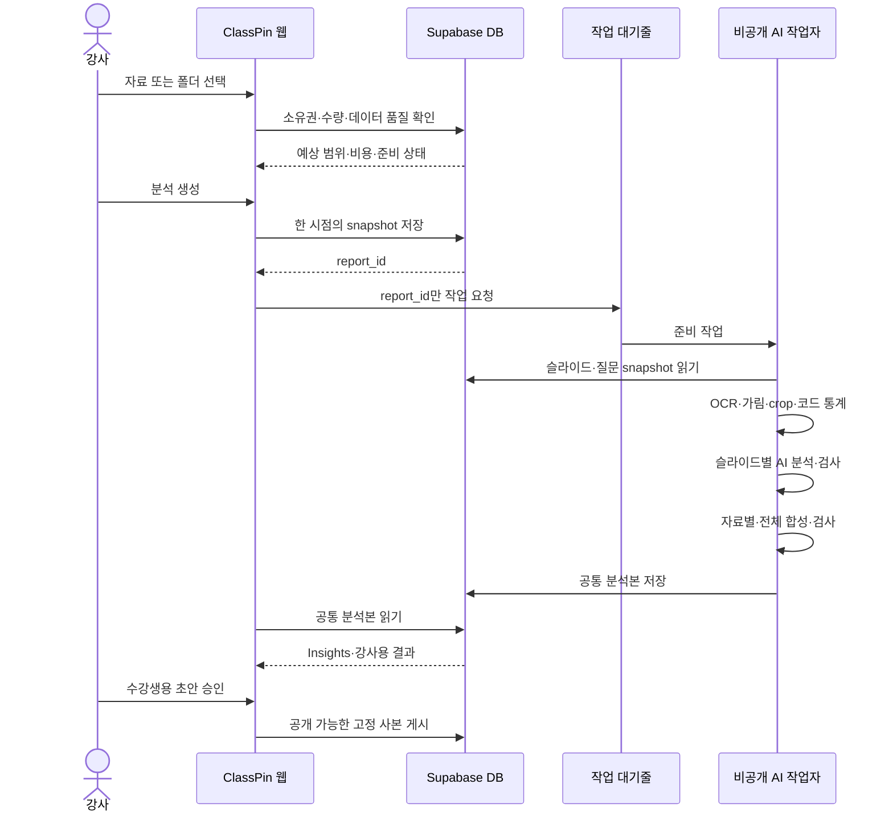
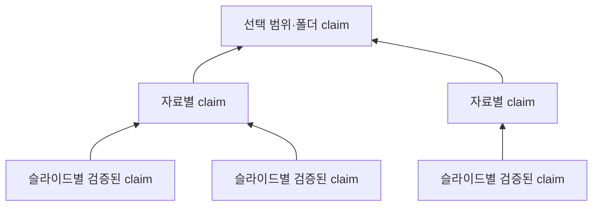

# ClassPin AI 분석 파이프라인·DB 상세 설계 초안

작성일: 2026-09-01  
상태: 제품 논의를 위한 연구 초안. 특허성은 판단하지 않는다. 실제 구현 전에 승인된 제품·근거·시스템 문서에 반영해야 한다.

## 1. 가장 쉬운 한 문장 설명

ClassPin AI는 다음 일을 하는 **세 명의 선생님**처럼 설계한다.

1. **계산 선생님**은 질문 수, 답변 수, PIN 위치 같은 정확한 사실을 코드로 센다.
2. **독해 선생님**인 AI는 슬라이드와 질문의 뜻을 읽고, 핵심 내용과 헷갈린 부분을 찾는다.
3. **검사 선생님**은 AI가 말한 내용이 실제 슬라이드·질문·숫자에 근거하는지 다시 확인한다.

한 번 만든 공통 분석본을 플랫폼 Insights, 강사용 리포트, 수강생 복습 리포트가 함께 사용한다. 화면마다 따로 계산하거나 AI를 다시 부르지 않는다.



## 2. 현재 DB를 쉬운 그림으로 보기

현재 ClassPin의 원본 장부는 아래 순서로 연결된다.



`material_versions`는 사용자에게 자료 수정·개정 기능을 제공하기 위한 것이 아니다. **어떤 업로드 원본에서 슬라이드가 만들어졌는지 고정하는 내부 기록**으로만 사용한다. 따라서 이 설계에는 개정판 비교나 플랫폼 안에서 자료를 수정하는 기능이 없다.

### 2.1 현재 데이터에서 바로 쓸 수 있는 것

2026-09-01 운영 DB를 식별정보 없이 집계한 결과다.

| 항목 | 현재 값 | 설계에 주는 뜻 |
| --- | ---: | --- |
| 자료 | 45개 | 자료 한 개 및 여러 자료 분석이 가능하다. |
| 슬라이드 | 425장 | 슬라이드별 분석 작업을 나눠 처리해야 한다. |
| 질문·PIN | 936건 | 질문 기반 분석의 재료가 있다. |
| 좌표 연결 | 936건 모두 연결 | 위치 기반 분석을 바로 시도할 수 있다. |
| 실제 답변 | 8건 | 답변 품질·응답 시간 분석은 아직 표본이 작다. |
| 공감 | 28건 | 보조 우선순위 신호로만 쓸 수 있다. |

### 2.2 먼저 고쳐야 할 데이터 준비 상태

| 문제 | 현재 상태 | 처리 원칙 |
| --- | --- | --- |
| 슬라이드 크기 | 425장 중 36장만 가로·세로 값 존재 | 이미지 bytes를 읽어 실제 크기를 기록한다. |
| 자료 checksum | 45개 모두 비어 있음 | 분석 전에 원본의 디지털 지문을 만든다. |
| 해결 상태와 답변 | resolved인데 답변 행이 없는 질문 5건 | `상태상 해결`과 `실제 답변 존재`를 다른 지표로 센다. |
| 강의 시간 | 시작·종료 시각이 모두 정상인 강의가 없음 | 현재 데이터로 체류시간이나 분당 질문을 계산하지 않는다. |
| 기억 테이블 | embedding이 모두 비어 있고 원문 불일치도 있음 | `course_brain_memory`를 리포트의 원본 근거로 쓰지 않는다. |
| 슬라이드 저장소 | 현재 public bucket | 수강생에게 자료를 배포하지 않는 정책과 분리해 재검토한다. |

### 2.3 DB 연결에서 꼭 검사할 부분

`questions`에는 `course_id`, `lecture_id`, `slide_id`, `region_id`가 각각 들어 있다. 외래키는 각 ID가 존재한다는 것은 확인하지만, **네 ID가 정말 한 강의 계보에 속하는지 전부 확인하지는 않는다.**

예를 들어 질문의 `lecture_id`는 A 강의를 가리키고, `slide_id`는 실수로 B 강의의 슬라이드를 가리키는 데이터가 이론상 생길 수 있다. 평소 앱이 올바르게 저장하더라도 AI 분석 시작 전에 아래를 다시 검사한다.

```text
질문.course_id = 자료가 속한 course
질문.lecture_id = 자료가 속한 lecture
질문.slide_id = 선택한 material_version의 slide
질문.region_id = 그 slide의 region_anchor
region_anchor.material_version_id = 그 slide의 material_version
답변.question_id = snapshot 안의 질문
공감.question_id = snapshot 안의 질문
```

연결이 어긋나면 AI가 알아서 추측하지 않는다. 분석을 중단하고 `SOURCE_LINEAGE_MISMATCH` 같은 안전한 오류를 강사에게 보여준다.

## 3. 전체 처리 순서



## 4. 0단계: 분석 시작 전 확인

어린이식 비유로는 **시험지를 인쇄하기 전에 페이지 수와 주인이 맞는지 확인하는 단계**다. 이때는 AI를 호출하지 않는다.

### 4.1 입력

- 강사가 선택한 범위: 자료 한 개, 여러 자료, 폴더 전체
- 로그인한 강사의 인증 정보
- 선택한 자료 목록
- 현재 자료·슬라이드·질문 수
- 슬라이드 분석 준비 상태

### 4.2 처리 흐름

1. 서버가 `auth.getUser()`로 현재 사용자를 확인한다.
2. 요청 본문에 들어온 `owner_id`는 받지도 믿지도 않는다.
3. 선택 자료가 모두 그 강사의 것인지 DB에서 확인한다.
4. 폴더 전체라면 그 순간 폴더에 들어 있는 자료 목록을 정렬해 고정한다.
5. 중복 선택을 제거한다.
6. 자료 수, 슬라이드 수, 질문 수, 예상 이미지 수, 예상 비용 범위를 계산한다.
7. checksum·이미지 크기·OCR 준비 여부를 검사한다.
8. 한도를 넘으면 일부를 몰래 빼지 않고 어떤 한도를 넘었는지 알려준다.
9. 10분 정도만 유효한 서명된 `preflight quote`를 만든다.

### 4.3 알고리즘

선택 목록은 아래와 같이 항상 같은 규칙으로 정렬한다.

```text
자료: 폴더 표시 순서 또는 created_at → material_id
슬라이드: page_index → slide_id
질문: created_at → question_id
답변: created_at → answer_id
```

같은 선택과 같은 원본이면 같은 `selection_hash`와 `source_fingerprint`가 나와야 한다. 해시는 JSON key 순서와 숫자 표현을 고정한 뒤 SHA-256으로 계산한다.

### 4.4 결과

강사에게 아래를 보여준다.

- 선택 자료·슬라이드·질문 수
- 질문이 없는 자료·슬라이드 수
- OCR 준비가 필요한 슬라이드 수
- 예상 처리 시간과 비용의 범위
- 외부 AI로 보내기 전에 가림 처리를 한다는 안내
- 생성 가능, 준비 필요, 차단 중 하나의 상태

## 5. 1단계: 슬라이드 원본 확인과 내용 읽기

이 단계는 **책 한 장마다 지문을 찍고, 글상자와 그림상자의 위치를 표시하는 일**이다.

### 5.1 업로드 직후 또는 첫 분석 전에 할 일

1. Storage에서 슬라이드 이미지 bytes를 비공개 작업자가 읽는다.
2. SHA-256 checksum을 계산한다. 이것이 슬라이드의 디지털 지문이다.
3. 실제 `width_px`, `height_px`를 읽는다.
4. 이미지 방향과 손상 여부를 검사한다.
5. OCR로 글자를 읽고 글자 상자의 위치를 0~1 좌표로 저장한다.
6. 레이아웃 분석으로 제목, 본문, 표, 차트, 수식, 그림 영역을 찾는다.
7. 개인정보 후보를 로컬에서 찾아 분석용 복사본에서 가린다.
8. 가려진 전체 이미지와 구조화 결과를 비공개 파생 저장소에 저장한다.

질문이 새로 생겨도 슬라이드 bytes와 분석기 버전이 같으면 이 결과를 다시 사용한다.

### 5.2 OCR block 구조

OCR은 긴 문자열 하나로 저장하지 않고 위치가 있는 조각으로 저장한다.

```json
{
  "block_alias": "B017",
  "type": "paragraph",
  "bbox_norm": { "x1": 0.12, "y1": 0.28, "x2": 0.71, "y2": 0.42 },
  "text_redacted": "광합성은 [가림]에서 일어납니다.",
  "ocr_confidence": 0.94,
  "reading_order": 6
}
```

외부 AI에는 가리기 전 문자열과 실제 DB UUID를 보내지 않는다.

### 5.3 개인정보 가림 순서

1. 로컬 OCR로 문자열과 위치를 찾는다.
2. 이메일, 전화번호, 주민등록번호 형태, 접근 token, API key 형태를 고정 규칙으로 찾는다.
3. 이름처럼 규칙으로 확정하기 어려운 항목은 로컬 탐지기가 `검토 필요`로 표시한다.
4. 가릴 위치를 이미지에 덮어 쓴 별도 사본을 만든다.
5. `종류·위치·탐지기 버전`만 기록하고 민감 원문을 분석 log에 남기지 않는다.
6. 가림 과정이 실패하면 원본을 그대로 보내지 않고 해당 분석을 실패시킨다.

### 5.4 권장 도구

- 이미지 checksum·crop·overlay: Python `Pillow` 또는 `OpenCV`
- OCR·레이아웃: 비공개 worker 안에서 버전을 고정한 로컬 엔진
- 한국어와 복잡한 표·레이아웃 품질을 우선하면 PaddleOCR/PP-Structure를 평가한다.
- 현재 승인된 시스템 문서에는 Tesseract가 명시되어 있으므로 PaddleOCR로 확정하려면 구현 전에 승인 문서를 바꾸고 개인정보 가림 평가를 다시 통과해야 한다.
- 두 OCR 엔진을 이유 없이 동시에 운영하지 않는다. 실제 fixture 비교에서 하나를 선택한다.

## 6. 2단계: PIN이 슬라이드의 무엇을 가리키는지 찾기

어린이식 비유로는 **책 페이지에 붙인 포스트잇이 어느 문장이나 그림을 가리키는지 찾는 일**이다.

### 6.1 좌표 변환

ClassPin 좌표는 0~1 사이의 비율이다. 실제 pixel 위치는 다음처럼 계산한다.

```text
pixel_x = normalized_x × image_width
pixel_y = normalized_y × image_height
```

예를 들어 너비 1,000px인 슬라이드에서 `x=0.25`면 왼쪽에서 250px 지점이다.

### 6.2 point PIN

1. point가 들어 있는 OCR·레이아웃 block을 찾는다.
2. 여러 block이 겹치면 가장 작은 block을 우선한다.
3. 어느 block에도 들어 있지 않으면 가장 가까운 block을 찾는다.
4. 거리가 정해진 한계보다 멀면 억지로 연결하지 않고 `unmapped`로 둔다.
5. crop은 point를 중심으로 슬라이드 너비와 높이의 각각 40%를 사용한다.
6. 가장자리를 넘으면 크기를 줄이지 않고 이미지 안쪽으로 이동한다.

### 6.3 box·path PIN

1. 모든 좌표의 최소 경계 상자를 구한다.
2. 가로·세로 10% 여백을 더한다.
3. crop이 어느 축에서 40%보다 작으면 그 축을 40%까지 넓힌다.
4. block과 겹치는 비율, 즉 IoU와 포함 비율을 계산한다.
5. 여러 block을 가리키면 읽기 순서대로 모두 연결한다.

### 6.4 공간 격자

슬라이드를 20×20, 총 400칸으로 나눈다.

```text
cell_x = min(19, floor(x × 20))
cell_y = min(19, floor(y × 20))
```

- point 질문은 한 칸에 무게 1을 준다.
- box·path가 여러 칸을 지나면 전체 무게 합이 1이 되도록 칸마다 나눠 준다.
- 이렇게 해야 긴 선 하나가 질문 20개처럼 부풀려지지 않는다.
- 같은 칸과 주변 8칸은 `가까운 PIN 후보`가 된다.

좌표는 **같은 슬라이드 안에서만** 비교한다. 다른 슬라이드의 오른쪽 위끼리는 아무 관계가 없다.

### 6.5 질문별 근거 묶음

각 질문마다 아래 묶음을 만든다.

```text
가린 전체 슬라이드
PIN 모양이 그려진 overlay
PIN 주변 crop
연결된 OCR·레이아웃 block
가린 질문 본문
사용자 category와 marker
질문 상태와 시간
시간순 답변
공감 수
```

speaker note, 참여자 UUID, 이메일, 인증 정보는 넣지 않는다.

## 7. 3단계: 질문을 분석 목적에 맞게 분류하고 걸러내기

여기서 `걸러낸다`는 말은 마음에 들지 않는 비판을 지운다는 뜻이 아니다. **어느 결과에 안전하게 사용할 수 있는지 목적별로 이름표를 붙이는 것**이다.

### 7.1 한 질문에 붙일 이름표

```json
{
  "route": "content_question",
  "safety": "clean",
  "pii": "redacted",
  "prompt_injection": "none",
  "duplicate_group": "DG004",
  "instructor_analysis": "include_redacted",
  "audience_report": "needs_review",
  "reason_codes": ["EMAIL_REDACTED"]
}
```

### 7.2 route 분류

- `content_question`: 강의 내용 질문
- `content_feedback`: 자료 내용에 대한 피드백
- `delivery_feedback`: 설명 속도·방식 등 강의 진행 피드백
- `platform_feedback`: ClassPin 사용 문제·기능 제안
- `social_or_reaction`: 인사·단순 반응
- `unknown`: 확신하기 어려움

플랫폼 오류 피드백은 강의 내용이 나쁘다는 근거로 사용하지 않는다. 정당한 비판은 욕설이 섞였더라도 가능한 범위에서 가리고 강사용 개선 분석에는 남길 수 있다.

### 7.3 중복 처리

1. Unicode NFKC, 앞뒤 공백, 연속 공백을 정리한다.
2. 완전히 같은 문자열은 결정론적 hash로 먼저 묶는다.
3. 같은 작성자가 같은 슬라이드에 짧은 시간 안에 반복 제출한 완전 중복은 독립 질문 1건으로 센다.
4. 서로 다른 작성자가 같은 질문을 했다면 서로 다른 독립 근거로 센다.
5. 작성자를 확인할 수 없으면 `독립 근거 수 불확실`을 한계로 표시한다.
6. 비슷하지만 같지 않은 질문은 AI가 의미 관계를 판정하고 코드가 참조를 검사한다.

작성자 ID는 이 계산을 하는 서버 안에서만 사용하고 외부 AI와 화면에는 내보내지 않는다.

### 7.4 부적절 데이터 처리

| 종류 | 강사용 분석 | 수강생용 리포트 | 원문 처리 |
| --- | --- | --- | --- |
| 개인정보 포함 | 가린 뒤 포함 가능 | 강사 검토 필요 | 민감 부분 가림 |
| 욕설 속 유효한 비판 | 의미를 중립적으로 요약 | 기본 제외 또는 강사 검토 | 원문 직접 노출 제한 |
| 위협·성적 내용·괴롭힘 | 안전 사건으로 별도 집계 | 제외 | 제한된 관리자 경로만 |
| prompt injection | 질문 데이터로만 처리 | 보통 제외 | AI 명령으로 실행 금지 |
| 플랫폼 피드백 | 플랫폼 개선함으로 전달 | 제외 | 강의 품질 지표에서 제외 |
| 의미 없는 도배 | 제외 또는 도배 건수만 표시 | 제외 | 독립 학습 근거로 계산 금지 |

## 8. 4단계: 코드로 정확한 숫자 계산

AI는 숫자를 세지 않는다. SQL과 순수 함수가 계산하고 `metric_id`를 붙인다.

### 8.1 기본 지표

| 지표 | 정확한 계산 |
| --- | --- |
| 질문 근거 범위 | 유효 질문이 있는 슬라이드 수 ÷ 선택 슬라이드 수 |
| 실제 답변 범위 | 실제 답변 행이 1개 이상인 유효 질문 수 ÷ 유효 질문 수 |
| 상태별 비율 | unanswered·answered·resolved·archived 각각 ÷ 유효 질문 수 |
| 첫 응답 시간 | 질문마다 가장 이른 답변 시각 - 질문 생성 시각 |
| 질문 유형 | route·사용자 category별 질문 수 |
| 자료 근거 범위 | 유효 질문이 있는 자료 수 ÷ 선택 자료 수 |
| 미배치 질문 | 선택 lecture에 속하지만 slide가 없는 질문 수 |
| 데이터 품질 | 좌표 오류, 낮은 OCR, 가림 실패, 분류 검토 필요 수 |

분모가 0이면 0%라고 속이지 않고 `계산할 근거 없음`으로 표시한다. 모든 비율 옆에는 `3/20`처럼 분자와 분모를 함께 보여준다.

### 8.2 응답 시간

답변이 있는 질문만 대상으로 한다.

```text
first_response_seconds(q) = min(answer.created_at) - q.created_at
```

평균 하나만 보여주지 않고 다음을 함께 기록한다.

- 표본 수 `n`
- 중앙값
- 25~75% 범위
- 가장 긴 값

현재는 답변이 8건뿐이므로 강의 전체의 일반적 응답 성능이라고 과장하지 않는다.

### 8.3 공간 집중도

각 격자 칸의 질문 무게를 합친 뒤 전체 질문 무게로 나눠 `p_cell`을 만든다.

```text
HHI = Σ(p_cell²)
effective_cells = 1 ÷ HHI
```

질문이 한곳에 몰리면 `effective_cells`가 작고, 넓게 퍼지면 커진다. 다만 질문이 1건뿐이면 `집중 패턴`이라고 부르지 않고 `개별 질문 위치`라고만 표시한다.

### 8.4 폴더 집계

자료별 50%, 100%를 단순 평균하지 않는다. 전체 분자와 분모를 다시 합친다.

```text
폴더 실제 답변 범위
= 모든 자료의 실제 답변 질문 수 합
  ÷ 모든 자료의 유효 질문 수 합
```

특정 자료 하나가 폴더 질문의 대부분을 차지하면 `자료 편중`을 함께 보여준다.

```text
largest_material_share
= 가장 질문이 많은 자료의 유효 질문 수
  ÷ 폴더 전체 유효 질문 수
```

### 8.5 미답변 우선순위

설명하기 어려운 비밀 점수 하나를 만들지 않는다. 아래 기준으로 차례대로 정렬한다.

1. 실제 답변이 없는 질문
2. 같은 뜻을 묻는 독립 질문 수가 많은 묶음
3. 공감 수가 많은 질문
4. 오래 기다린 질문
5. 강사가 정한 category 우선순위

화면에는 각 질문이 위에 온 이유를 그대로 보여준다.

## 9. 5단계: AI가 슬라이드와 질문의 뜻을 분석

AI는 `무엇을 뜻하는가`를 읽는다. 숫자와 증거 수준은 코드가 정한다.

### 9.1 AI 입력

- 가린 전체 슬라이드 이미지
- PIN overlay
- 질문별 crop
- OCR·레이아웃 block
- alias로 바꾼 질문·답변
- 코드가 만든 metric
- 출력해야 할 엄격한 JSON Schema

실제 UUID 대신 한 분석 안에서만 쓰는 `M001`, `S004`, `Q017` 같은 별명을 보낸다.

### 9.2 슬라이드별 AI 출력

```json
{
  "slide_summary": {
    "text": "광합성의 두 단계를 비교하는 슬라이드",
    "slide_refs": ["S004"]
  },
  "key_concepts": [
    { "label": "명반응", "block_refs": ["B003"], "question_refs": ["Q017"] }
  ],
  "question_signals": [
    {
      "label": "두 단계의 위치가 혼동됨",
      "question_refs": ["Q017", "Q021"],
      "relation": "same_confusion"
    }
  ],
  "unanswered_question_refs": ["Q021"],
  "improvement_candidates": [
    {
      "type": "add_comparison_label",
      "text": "두 단계가 일어나는 장소를 표의 별도 열로 표시",
      "question_refs": ["Q017", "Q021"],
      "block_refs": ["B003", "B008"]
    }
  ],
  "limitations": ["질문 표본이 2건임"]
}
```

### 9.3 같은 뜻·모순·무관 판정

같은 슬라이드의 질문 관계는 두 종류로 나눈다.

1. **공간 관계**: 같은 격자 또는 주변 격자인가?
2. **의미 관계**: 같은 혼란을 말하는가, 서로 반대되는가, 관련 없는가?

가까운 PIN이라도 뜻이 다르면 묶지 않는다. 멀리 떨어진 PIN이 같은 주제를 말하면 `같은 주제·다른 위치`로 기록할 수 있지만 `한 위치의 hotspot`이라고 부르지 않는다.

AI가 반환하는 관계는 다음으로 제한한다.

- `supports_same_signal`
- `contradicts`
- `related_but_distinct`
- `unrelated`

코드는 모든 질문 참조가 실제 snapshot에 있고 같은 슬라이드인지 확인한다.

### 9.4 근거 수준

AI가 `반복 혼란`이라는 말을 마음대로 붙이지 못한다. 코드는 참조 수로 이름을 정한다.

| 근거 | 허용 표현 |
| --- | --- |
| 질문 0건 | 자료 내용 요약. 수강생 반응이라고 표현 금지 |
| 독립 질문 1건 | 한 질문에서 나타난 신호 |
| 독립 질문 2건 이상 | 반복 질문 또는 반복 혼란 후보 |
| 서로 다른 슬라이드 2장 이상 | 자료 안에서 반복된 주제 |
| 서로 다른 자료 2개 이상 | 선택 범위에서 반복된 주제 |

공감 20개가 있어도 독립 질문 1건이면 첫 번째 표의 `질문 1건` 수준을 넘지 않는다.

### 9.5 생성 모델과 검사 모델

1. 생성 모델이 구조화 분석 후보를 만든다.
2. 코드가 JSON Schema, 별명, 좌표, metric 값을 검사한다.
3. 별도의 비평 모델이 과장, 근거 누락, 모순 은폐, 개인정보 위험을 검사한다.
4. 코드가 비평 결과의 참조도 다시 검사한다.
5. 하나라도 실패하면 해당 슬라이드는 성공으로 기록하지 않는다.

비평 모델에는 생성 모델의 숨은 생각을 보내지 않는다. 원본 근거, 생성된 결과, 검사 규칙만 준다.

## 10. 6단계: 슬라이드에서 자료, 자료에서 폴더로 합치기

어린이식 비유로는 **각 반의 발표를 먼저 정리하고, 그다음 전교 공통점을 찾는 일**이다.

### 10.1 3층 합성



1. **슬라이드 층**: 이미지, PIN, 질문 원문을 직접 본다.
2. **자료 층**: 검증된 슬라이드 claim과 코드 metric만 본다.
3. **폴더·선택 층**: 검증된 자료 claim과 코드 metric만 본다.

상위 단계로 갈수록 원본을 다시 마음대로 읽지 않고, 아래 단계에서 검증된 작은 근거 조각만 사용한다.

### 10.2 범위가 넓어지는 조건

- 자료 안의 반복 주제: 서로 다른 슬라이드 2장 이상이 지지
- 폴더 안의 반복 주제: 서로 다른 자료 2개 이상이 지지
- 한 자료에서 질문 100개가 나와도 다른 자료가 지지하지 않으면 `폴더 공통 주제`가 아니라 `그 자료에 집중된 주제`
- 폴더는 정리 상자일 뿐이므로 폴더에 같이 있다는 이유만으로 같은 뜻으로 묶지 않음

### 10.3 공통 분석본의 claim 구조

```json
{
  "claim_id": "C032",
  "claim_type": "confusion_signal",
  "scope": "material",
  "text_seed": "조건 A와 B를 적용하는 순서에서 반복 질문이 나타남",
  "evidence_level": "cross_slide_repeated_questions",
  "slide_refs": ["S004", "S011"],
  "supporting_question_refs": ["Q017", "Q021", "Q052"],
  "opposing_question_refs": [],
  "metric_refs": ["METRIC_ANSWER_COVERAGE_01"],
  "limitations": ["질문이 전체 슬라이드의 18%에서만 수집됨"]
}
```

`text_seed`는 여러 화면이 표현을 바꿀 때 사용하는 안전한 핵심 문장이다. 근거 참조와 사실은 revision이 바꾸지 못한다.

### 10.4 공통 분석본의 최상위 구조

```text
source_snapshot
data_quality
metrics
materials
claims
open_questions
improvement_candidates
audience_candidate_claims
limitations
model_and_policy_fingerprints
```

이것이 하나의 권위 있는 분석본이다. 플랫폼과 문서가 이 안의 값을 다시 계산하지 않는다.

## 11. 7단계: 플랫폼 Insights

Insights는 두 부분으로 나눈다.

### 11.1 AI 없이 즉시 보이는 부분

- 질문 근거 범위
- 실제 답변 범위
- 상태별 질문 수
- 응답 시간
- 슬라이드 hotspot
- 공간 overlay
- 자료별 질문 편중
- 데이터 품질

현재 `PIN 비율`은 936개 질문 모두 PIN이 있으므로 거의 항상 100%다. `질문 근거 범위`로 바꾸는 편이 더 유용하다. 현재 `해결률`도 실제 답변 존재와 분리한다.

### 11.2 AI 분석 뒤 보이는 부분

- 핵심 주제
- 반복 혼란
- 모순 또는 확인이 필요한 쟁점
- 미답변 질문 묶음
- 개선 작업 후보
- 분석 한계

### 11.3 권장 화면 구조

```text
Overview     숫자·데이터 품질
Hotspots     슬라이드 순위·PIN 위치
Topics       핵심 내용·반복 질문
Questions    미답변·유사 질문·routing
Improvements 개선 작업 후보
Reports      강사용 결과·수강생용 초안
```

기존의 `전체/자료별 chip`을 유지한다. 카드를 누르면 해당 슬라이드와 PIN으로 이동하고, `왜 이런 결론인가`를 누르면 근거 목록을 보여준다.

### 11.4 새 데이터 표시

대시보드를 열 때마다 AI를 부르지 않는다.

1. 마지막 완료 report의 `source_fingerprint`를 읽는다.
2. 현재 원본의 가벼운 freshness fingerprint와 비교한다.
3. 같으면 기존 분석을 보여준다.
4. 다르면 기존 분석은 그대로 보여주되 `질문 7건이 새로 생겼습니다`처럼 표시한다.
5. 새 분석은 새 `ai_reports` 행으로 만든다. 이전 결과를 덮어쓰지 않는다.

## 12. 8단계: 강사용 리포트

강사용 리포트는 공통 분석본을 두 방식으로 표현한다.

### 12.1 A형: 근거 카드

- 숫자와 분자·분모
- hotspot 이미지
- claim별 슬라이드·PIN 링크
- 미답변 목록
- 개선 후보와 근거
- 데이터 품질과 한계

### 12.2 B형: 읽기 쉬운 문서

- 강의 핵심 내용과 흐름
- 수강생 질문으로 확인된 관심·혼란
- 강의 대응 현황
- 가장 먼저 검토할 슬라이드
- 구체적 개선 작업 후보
- 말할 수 없는 결론과 데이터 한계

A형과 B형은 같은 claim과 metric을 사용한다. 문장 표현만 다르다.

### 12.3 AI 수정 요청

강사가 `더 짧게`, `경영진용으로`, `개선안 순서를 바꿔줘`라고 요청할 수 있다. 이 revision은 다음만 바꾼다.

- 문장 길이와 말투
- claim 순서
- 같은 claim 중 표시할 항목
- 허용된 설명 방식

다음은 바꾸지 못한다.

- snapshot
- 질문·슬라이드 참조
- 계산된 숫자
- claim의 지지·반대 근거
- 근거 수준

확정된 revision만 PDF로 만들고, PDF와 화면은 같은 renderer를 사용한다.

## 13. 9단계: 수강생 복습 리포트

수강생 리포트는 강사용 리포트를 짧게 복사한 것이 아니다. **공개 가능한 근거만 다시 골라 만든 별도 결과**다.

### 13.1 포함할 내용

- 핵심 개념 5~10개
- 개념의 흐름
- 강의 중 많이 나온 질문의 중립적 요약
- 강사가 승인한 핵심 Q&A
- 자주 혼동된 두 개념의 차이
- 복습 체크리스트와 연습 질문

### 13.2 공개 필터

1. `audience_report_eligible`인 claim만 고른다.
2. 답변은 `participants` 또는 `public`만 사용한다.
3. private 답변, 작성자 정보, speaker note, 내부 플랫폼 피드백을 제거한다.
4. 원본 슬라이드 이미지와 Storage URL은 기본 포함하지 않는다.
5. 질문 원문은 그대로 복사하기보다 개인정보를 제거한 중립 문장으로 바꾼다.
6. 근거를 제거한 뒤에도 claim이 성립하는지 코드와 비평 모델이 다시 검사한다.
7. 강사가 최종 확인한 고정 사본만 게시한다.

### 13.3 접근 권한

첫 버전은 `해당 강의 참여자 전용 + 강사 승인`이 적절하다.

현재 join code만으로는 질문을 쓰지 않은 참여자를 강의 종료 후 확인할 수 없다. 따라서 join 성공 때 최소 membership을 남긴다.

```text
lecture_participations
  lecture_id
  participant_id
  joined_at
  primary key (lecture_id, participant_id)
```

이 기록은 출석 감시용이 아니라 복습 리포트 접근 권한을 확인하기 위한 최소 기록이다. 게시물은 고정된 사본으로 저장하며, 강사가 철회하면 이후 접근을 막는다. 이미 내려받은 파일을 되찾을 수 있다고 약속하지 않는다.

## 14. 공통 분석과 리포트를 위한 권장 DB

### 14.1 원본 장부는 그대로 둔다

기존 테이블은 계속 권위 원본이다.

```text
session_folders / courses / lectures / materials / material_versions
slides / region_anchors / questions / answers / question_reactions
```

AI 결과를 원본 질문이나 슬라이드 행에 덮어쓰지 않는다.

### 14.2 재사용 가능한 슬라이드 분석: `ai_slide_artifacts`

슬라이드 내용은 질문이 새로 들어와도 바뀌지 않으므로 재사용 가치가 크다.

```text
id uuid PK
owner_id uuid
slide_id uuid FK
source_sha256 text
pipeline_version text
status text
width_px / height_px integer
ocr_blocks jsonb
layout_blocks jsonb
redaction_manifest jsonb
base_slide_analysis jsonb
ocr_engine_fingerprint text
model_fingerprint text
schema_version text
private_asset_prefix text
created_at timestamptz

UNIQUE(slide_id, source_sha256, pipeline_version)
```

이 테이블을 도입하려면 현재 승인된 6개 report table 설계에 추가된 변경이므로 구현 전에 관련 승인 문서를 갱신해야 한다.

### 14.3 고정 snapshot과 공통 분석

기존 승인 설계의 6개 테이블을 중심으로 사용한다.

#### `ai_reports`

- 강사, 선택 종류, 폴더 snapshot
- cutoff 시각과 source fingerprint
- queued부터 ready까지 상태·진행률
- 정확한 전체 metric
- 공통 canonical 분석
- model·prompt·schema·policy fingerprint
- 비용·사용량
- 현재·확정 revision
- 이전 report 연결

#### `ai_report_materials`

- report 안의 자료 순서와 alias
- 원본 material·material_version mapping
- 제목과 checksum snapshot
- 자료별 metric
- 검증된 자료별 분석

#### `ai_report_slides`

- report·material·slide mapping과 순서
- slide checksum과 artifact 참조
- 불변 `question_snapshot_jsonb`
- crop·overlay 비공개 경로
- 슬라이드별 metric
- AI 후보, 코드 검증, 비평 결과
- 상태·재시도·사용량

질문 snapshot 예시는 다음과 같다.

```text
schema_version
questions[]
  alias
  source mapping        서버 내부에서만
  redacted_text
  category / marker / status / occurred_in
  created_at
  anchor kind / coords / crop / block refs
  answers[]             시간순, 가린 본문, visibility
  reaction_count
  eligibility / reason codes
  normalized_content_hash
```

#### `ai_report_revisions`

- revision 번호와 앞 revision
- A형·B형 표시 결과
- 강사의 수정 지시
- 사용한 claim 목록
- 검증·비평 결과
- 비용·사용량

#### `ai_report_jobs`

- stage, unit alias, 상태, attempt
- lease owner와 만료 시각
- task 이름과 idempotency key
- 안전한 오류 code
- 시작·종료 시각

#### `ai_report_storage_cleanup`

- 삭제해야 할 비공개 Storage prefix
- 시도 횟수와 다음 시도 시각
- 마지막 안전한 오류 code

### 14.4 질문 annotation을 별도 테이블로 만들지 여부

첫 report 버전에서는 분류 결과를 `question_snapshot_jsonb` 안에 저장하는 편이 단순하고 안전하다. 그러면 나중에 정책이 바뀌어도 옛 report의 판정이 몰래 변하지 않는다.

실시간 질문 routing·moderation을 Insights 밖에서도 계속 제공하게 될 때만 `ai_question_annotations`를 추가한다. 그때는 `question_id + source_updated_at + policy_version`을 고유 기준으로 삼고, 사람의 override를 별도 필드로 보존한다.

### 14.5 수강생 게시용: `ai_report_publications`

```text
id
owner_id
report_revision_id
lecture_id
audience_scope          session_participants | expiring_link | public
published_content_json
published_at
expires_at
revoked_at
token_hash
```

내부 canonical JSON을 직접 공개하지 않고 승인된 공개용 고정 사본만 넣는다.

## 15. snapshot을 만드는 정확한 방법

스냅샷은 **움직이는 장면을 사진 한 장으로 찍는 것**이다. 분석 중 질문이 추가되어도 이번 분석의 사진은 바뀌지 않는다.

### 15.1 짧은 DB transaction

소유권을 검사하는 비공개 RPC가 한 transaction 안에서 다음을 수행한다.

```text
1. cutoff와 report_id 결정
2. 선택한 자료 membership 고정
3. material_version·slide 목록 고정
4. cutoff까지의 질문·답변·공감 복사
5. 계보 연결 검사
6. alias와 순서 부여
7. 코드 metric 계산
8. canonical serialization과 snapshot hash 계산
9. report/material/slide/job 행 저장
10. commit
```

외부 AI, Storage 다운로드, OCR은 이 transaction 안에서 실행하지 않는다. 긴 작업 때문에 질문 등록이 기다리지 않게 하기 위해서다.

### 15.2 idempotency

강사가 버튼을 두 번 누르거나 네트워크가 재시도해도 같은 요청으로 report가 두 개 생기지 않아야 한다.

- 클라이언트가 무작위 `idempotency_key`를 한 번 만든다.
- 같은 key와 같은 payload면 기존 report를 돌려준다.
- 같은 key인데 payload가 다르면 `409`로 거부한다.

### 15.3 슬라이드 bytes 변경 방지

snapshot에는 준비된 slide artifact의 checksum을 기록한다. worker가 실제 bytes를 다시 읽었을 때 checksum이 다르면 분석하지 않고 `SOURCE_CHANGED`로 실패시킨다. 새 snapshot으로 다시 생성해야 한다.

## 16. 작업 대기줄과 실패 처리

### 16.1 상태

```text
queued
→ preparing
→ analyzing
→ synthesizing
→ criticizing
→ ready
→ confirmed

어느 단계에서든 복구할 수 없으면 failed
삭제 중이면 deleting
```

### 16.2 내부 작업 순서

1. coordinator가 report job을 claim한다.
2. checksum·artifact·가림 자료를 준비한다.
3. 슬라이드 작업을 제한된 수만 병렬 실행한다.
4. 모든 슬라이드가 성공하면 자료별 합성을 실행한다.
5. 모든 자료가 성공하면 선택 범위 합성을 실행한다.
6. 전체 비평과 코드 검증을 실행한다.
7. 공통 분석본과 첫 revision을 한 transaction으로 저장한다.
8. report를 ready로 바꾼다.

작업 메시지에는 `job_id`, `stage`, `unit_alias`만 넣는다. 강의 내용, 질문, 이미지, secret을 넣지 않는다.

### 16.3 중복 실행 방지

- task 이름은 `job_id + stage + unit_alias`의 hash로 만든다.
- worker는 짧은 조건부 update로 lease를 얻는다.
- 이미 성공한 작업이면 AI를 다시 호출하지 않고 성공 응답한다.
- timeout, 429, provider 5xx만 최대 3회 지수 backoff로 재시도한다.
- 개인정보 가림 실패, checksum 불일치, 권한 오류, 비용 상한 초과는 자동 재시도하지 않는다.

### 16.4 부분 결과

첫 버전에는 슬라이드 하나가 최종 실패해도 나머지만 모아 완성된 리포트처럼 보여주지 않는다. report 전체를 실패로 두고, 어느 단계가 실패했는지 안전한 코드로 알려준다. 성공한 슬라이드 작업은 같은 설정의 수동 재시도에서 재사용한다.

## 17. API와 권한 경계

권장 API는 다음 정도면 충분하다.

```text
POST /api/admin/ai-reports/preflight
POST /api/admin/ai-reports
GET  /api/admin/ai-reports
GET  /api/admin/ai-reports/{id}
POST /api/admin/ai-reports/{id}/retry
POST /api/admin/ai-reports/{id}/revisions/preflight
POST /api/admin/ai-reports/{id}/revisions
POST /api/admin/ai-reports/{id}/confirm
GET  /api/admin/ai-reports/{id}/pdf
DELETE /api/admin/ai-reports/{id}
POST /api/admin/ai-reports/{id}/publications
DELETE /api/admin/ai-report-publications/{id}
GET  /api/join/reports/{publication_id}
```

### 17.1 RLS와 service role

- 강사는 자기 report만 읽는다.
- 다른 강사와 익명 참여자는 내부 report를 읽지 못한다.
- 참여자는 membership과 publication 정책을 통과한 공개 사본만 읽는다.
- 브라우저는 service role key를 절대 받지 않는다.
- worker의 privileged 함수도 report owner와 source owner를 직접 비교한다.
- owner API는 참여자 ID, alias mapping, 내부 prompt, 원시 provider 오류를 제거한 DTO만 반환한다.

### 17.2 Storage

- 가린 이미지·crop·overlay는 비공개 `ai-report-evidence` bucket에 둔다.
- 강사용 근거 화면은 소유권 확인 후 최대 5분 signed URL을 발급한다.
- 외부 AI에는 signed URL을 보내지 않고 worker가 읽은 가린 bytes를 직접 보낸다.
- 수강생 리포트에는 원본 이미지 URL을 넣지 않는다.
- report 또는 원본 자료 삭제 때 DB outbox와 Storage cleanup을 함께 시작한다.

## 18. 필요한 인덱스 후보

현재 규모는 작으므로 보이는 모든 열에 인덱스를 추가하지 않는다. 실제 snapshot 쿼리를 `EXPLAIN (ANALYZE, BUFFERS)`로 측정하고 필요한 것만 추가한다.

후보는 다음과 같다.

```text
questions(slide_id, created_at, id) WHERE slide_id IS NOT NULL
region_anchors(slide_id, id)
answers(question_id, created_at, id)
ai_reports(owner_id, created_at DESC, id DESC)
ai_report_materials(report_id, ordinal)
ai_report_slides(report_id, material_ordinal, slide_ordinal)
ai_report_jobs(status, lease_expires_at) WHERE status IN ('queued', 'running')
ai_report_publications(lecture_id, published_at DESC) WHERE revoked_at IS NULL
```

이미 있는 `slides(material_version_id, page_index)` unique index, `question_reactions(question_id, reactor_id)` 기본키, `answers(question_id)` index와 겹치는지 확인한 뒤 교체 또는 확장한다.

## 19. VectorDB와 GraphDB

### 19.1 첫 버전에는 둘 다 필요하지 않다

- 한 report의 자료·슬라이드·질문은 고정 snapshot으로 모두 읽을 수 있다.
- 숫자는 PostgreSQL이 잘 계산한다.
- 계층 관계는 기존 외래키로 충분하다.
- report 안의 claim 관계는 JSONB 참조로 보존할 수 있다.

### 19.2 pgvector가 필요해지는 때

- 수천 개의 과거 자료에서 비슷한 질문 찾기
- 다른 강의에 반복된 개념 검색
- 강사가 자연어로 과거 수업을 검색
- 답변 초안에 사용할 관련 슬라이드·기존 답변 top-k 검색

그때도 외부 VectorDB보다 현재 Supabase의 pgvector부터 검토한다. 검색 결과는 후보를 찾는 도구일 뿐 report의 권위 근거가 될 수 없다. 최종 claim은 다시 고정 snapshot과 실제 source를 참조해야 한다.

### 19.3 GraphDB가 필요해지는 때

여러 코스의 선수지식, 학습목표, 개념, 질문을 장기간 연결하고 `A를 모르고 B를 틀린 학생이 C까지 가는 경로` 같은 여러 단계 탐색이 핵심 제품이 될 때만 검토한다. 현재 폴더→자료→슬라이드→PIN 구조에는 PostgreSQL이 더 단순하다.

## 20. 강의 시간 분석을 추가하려면

현재 `current_page`는 지금 보이는 한 장만 알려주며, 과거 체류 기록은 없다. 아래 테이블을 별도 기능으로 추가해야 한다.

```text
lecture_slide_events
  id
  lecture_id
  slide_id
  entered_at
  exited_at
  source              presenter_navigation | resume | end
```

강사가 슬라이드를 바꿀 때 DB 함수가 이전 event를 닫고 새 event를 연다. 이것으로 다음을 코드가 계산할 수 있다.

- 슬라이드 체류시간
- 노출 후 첫 질문까지 시간
- 질문이 급증한 구간
- 다시 방문한 슬라이드

수강생의 모든 클릭과 마우스 이동을 추적할 필요는 없다.

## 21. 학습 변화 분석을 추가하려면

현재 질문·PIN·공감만으로 `학습효과가 증명되었다`고 말할 수 없다. 질문이 줄어든 이유는 이해, 포기, 참여 감소 중 무엇인지 알 수 없기 때문이다.

학습 변화를 측정하려면 다음이 필요하다.

```text
learning_objectives
assessment_items
assessment_phases          pre | post | follow_up
assessment_responses
participant_measurement_keys
```

### 21.1 계산

- 같은 가명 참여자의 사전·사후 응답만 짝지어 비교한다.
- 객관식 정답은 코드가 채점한다.
- `post score - pre score`를 사람마다 계산한다.
- 표본 수, 평균·중앙값 변화, 신뢰구간, 효과크기를 함께 표시한다.
- 사후 응답을 하지 않은 사람 수와 응답률을 함께 보여준다.
- AI는 어떤 목표에서 변화가 컸는지 설명하지만 점수를 계산하지 않는다.

비교집단이나 적절한 연구 설계가 없으면 `강의 때문에 좋아졌다`는 인과관계를 주장하지 않는다. 제품 이름도 `학습효과 증명`보다 `학습 변화 리포트`가 정확하다.

## 22. 품질 검사와 출시 기준

### 22.1 코드 검사

- 같은 이미지·좌표에서 crop이 항상 같은가
- point·box·path 경계가 0~1을 벗어나지 않는가
- 질문 하나의 공간 무게 합이 1인가
- 비율의 분자·분모가 맞는가
- 폴더 비율을 자료별 백분율 평균으로 잘못 계산하지 않는가
- AI의 모든 slide·question·metric 참조가 snapshot에 있는가
- revision이 claim이나 숫자를 바꾸지 않는가

### 22.2 AI 평가 fixture

- 한국어·영어 혼합, 작은 글자, 표, 그래프, 수식
- 같은 위치의 다른 뜻, 다른 위치의 같은 뜻
- 질문 0건·1건·여러 건
- 개인정보, 욕설 속 정당한 비판, 도배, prompt injection
- 서로 모순되는 질문
- 자료 한 개에 질문이 편중된 폴더
- 비공개 답변과 공개 답변 혼합

### 22.3 반드시 0건이어야 하는 오류

- snapshot에 없는 출처 참조
- 잘못된 metric 값
- 다른 강사의 자료 노출
- speaker note·참여자 ID·private 답변의 수강생 노출
- 가림 실패 후 원본 외부 전송
- 슬라이드 누락 상태의 완성 report 노출

OCR 정확도와 의미 분류 정확도는 실제 ClassPin fixture로 기준선을 먼저 측정한 뒤 출시 목표를 정한다. 근거 없이 숫자 목표를 먼저 만들지 않는다.

### 22.4 크기·성능 검사

1·10·50·300장 슬라이드와 슬라이드당 질문 0·1·10·100개 조합으로 preflight, snapshot, OCR, AI 분석, 합성, PDF 시간을 측정한다. 외부 호출은 제한된 동시성으로 실행하되 최종 결과 순서는 snapshot ordinal로 고정한다.

## 23. 가장 현실적인 도입 순서

### 1차: 원본 데이터 준비

- 슬라이드 checksum·크기 생성
- 계보 검사 함수
- 비공개 파생 Storage
- OCR·가림 fixture 평가

### 2차: AI 없는 Insights 개선

- PIN 비율을 질문 근거 범위로 교체
- 해결 상태와 실제 답변 범위 분리
- 공간 hotspot과 데이터 품질 표시
- 자료별 편중 표시

### 3차: 자료 한 개의 강사용 AI 분석

- 고정 snapshot
- 질문 목적 분류
- 슬라이드별 의미 분석
- 근거 검증
- 핵심 내용·혼란·미답변·개선 후보

### 4차: 여러 자료·폴더 합성

- 슬라이드→자료→선택 범위 계층 합성
- 반복 범위와 자료 편중 검증
- 공통 canonical 분석을 Insights와 리포트에서 공유

### 5차: 수강생 복습 리포트

- participation membership
- 공개 필터
- 강사 승인
- 비공개 고정 publication

### 6차: 필요한 경우만 확장

- 강의 시간 event
- 과거 강의 검색용 pgvector
- 학습목표·사전/사후 측정

## 24. 첫 MVP에서 실제로 만들 기능

첫 AI MVP는 다음 한 흐름으로 제한하는 것이 좋다.

1. 강사가 폴더 Insights에서 자료 한 개를 선택한다.
2. 시스템이 질문 근거 범위와 데이터 품질을 먼저 보여준다.
3. 준비된 슬라이드와 PIN 문맥으로 슬라이드별 분석을 만든다.
4. `핵심 내용`, `반복 혼란`, `미답변`, `개선 작업 후보`를 공통 분석본에 저장한다.
5. 모든 문장에서 해당 슬라이드·PIN·metric을 열 수 있다.
6. 같은 결과를 Insights 카드와 강사용 A/B 리포트에 사용한다.
7. 수강생용 복습본은 초안까지만 만들고, 강사 승인·membership 기능이 준비된 뒤 게시한다.

첫 MVP에는 GraphDB, 별도 VectorDB, 실시간 자동 답변 게시, 자료 수정·version-up, 학습효과 증명을 넣지 않는다.

## 25. 이번 설계에서 결정해야 할 제품 선택

구현 전 다음 순서로 결정하면 된다.

1. 첫 MVP가 자료 한 개만 지원할지, 처음부터 폴더까지 지원할지
2. OCR을 현재 승인안의 Tesseract로 시작할지, PaddleOCR 평가 후 문서를 바꿀지
3. `ai_slide_artifacts` 캐시를 첫 release에 포함할지
4. 부적절 질문의 사람 검토 화면을 첫 release에 포함할지
5. 수강생 복습 리포트를 첫 release에 초안만 만들지, 참여자 전용 게시까지 만들지
6. 현재 public 슬라이드 bucket을 AI 기능과 함께 private로 전환할지 별도 보안 변경으로 진행할지

## 26. 참고 문서

- `doc/research/2026-09-01/ClassPin_AI_기능_제품설계_초안.md`
- `docs/ai-instructor-report-product.md`
- `docs/ai-instructor-report-evidence.md`
- `docs/ai-instructor-report-system.md`
- PaddleOCR 다국어 OCR·bounding box: https://github.com/PaddlePaddle/PaddleOCR/blob/main/docs/version2.x/ppocr/quick_start.en.md
- PaddleOCR PP-StructureV3: https://github.com/PaddlePaddle/PaddleOCR/blob/main/docs/version3.x/pipeline_usage/PP-StructureV3.md
- Supabase vector column: https://supabase.com/docs/guides/ai/vector-columns
- 이미지 입력·구조화 출력 API 예시: https://platform.openai.com/docs/api-reference/responses
